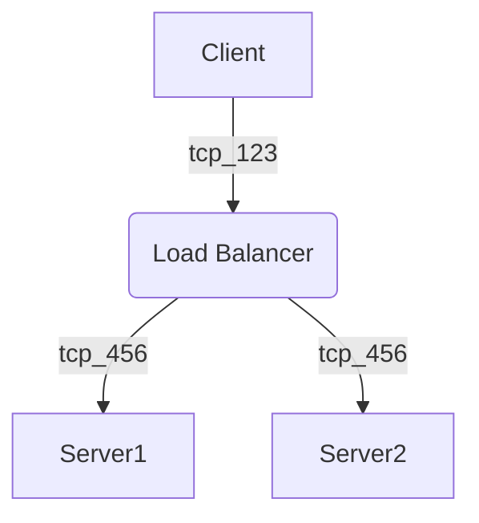

[SOPHIE][dtp22] の復習をする。プレイしていて違和感があるところを集中的に、戦闘コマンド、出現敵周りを調べる。
宝箱は調査分でもう新たな事実は出て来ないので最終結果とする。今晩はノートに書く時間がない。

2:55 裏ボスが強いのでゲームを終了。仲間を死なさぬように踏ん張るとしか方針がない。

3:00 就寝。

10:25 起床。まだ眠れる。納豆と赤飯おにぎりを食う。PC を開く。

* [Markdown Preview Mermaid Support - Visual Studio Marketplace](https://marketplace.visualstudio.com/items?itemName=bierner.markdown-mermaid):
  VS Code にこの拡張をインストールして、次のようなコード片をグラフィックに変換したものを
  VS Code 内で確認できるようにする。



あとは当ブログでも描画されるように、最低限でも JavaScript のコードをロードするようにはしないといけない。
これは後ほどにする。

12:20 おやつ。まだ食うのか。

13:00 生の HTML から `script` タグ経由で Mermaid を描画させる実験をする。方式としては MathJax に近いようだ。
ということは、このブログに組み込む方法も同様なものになるだろう。

14:35 眠い。

18:25 起床。外出。

スカイツリータウン二階。トイレと書店。

押上駅バス停。すぐにバスが来る。乗って錦糸公園前まで移動。

19:10 カスミオリナス錦糸町店。641 円。クーポンを消費してまた獲得。

* 豚レバーもやし炒め丼
* 野菜ジュース (900)
* ブラックチョコ (3)

タイトー F ステーションオリナス錦糸町店。MJ イベントルーム。
日曜なのに幻球乱舞東風戦を開催しているのでやってしまう。案の定振るわず 10 クレもはたいてこのザマ。
途中から放銃しまくり、雲行きが怪しすぎる。
チートイだのトイトイだのメンホンの字牌シャンポンだのわからない。

```text
合計スコア -68.9
平均スコア -4.05

平均順位 2.53 着
トップ 4 回
二着 5 回
三着 3 回
ラス 5 回

アガリ率 12.99% (10)
アガリ飜平均 2.60
アガリ巡目平均 10.20 巡
振り込み率 14.29% (11)
```

これでトータルマイナ 9 個とかだと記憶している。二段ほど段位が降格した。

外へ出ると小雨が降っているか？

23:00 ビッグエー墨田業平店。248 円。

* 大きなコロッケバーガー
* 絹豆腐
* 小海老天そば
* ジャムパン

曳舟の部屋。入浴。

23:50 風呂から出て PC を開く。晩飯。ヤケクソの一日だった。

[dtp22]: https://wodifes.net/game/show/469
