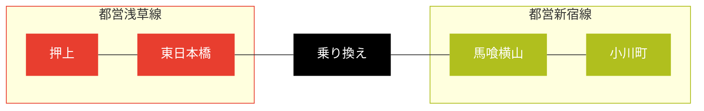

0:35 [Mermaid.JS] Flowchart の章を試し終わる。この章の習得だけで Graphviz の普通の使い方でできることは全部できる。
さっそく何か定義してみよう：



* [【BPL 2021】 DJ LIVE - かめりあ - YouTube](https://www.youtube.com/watch?v=UkhWc3cD4Ok):
  皆伝おめでとうございます。
* [実践ですぐに使える山読みの技術【雀龍門M】 - YouTube](https://www.youtube.com/watch?v=JnCGAlsle_Q):
  今回は上級者向け。残っていそうな牌を考えるのは色だけでなく数もやるのか。
* [Lv12ダブルフルコン10曲出すまで帰れない？ - YouTube](https://www.youtube.com/watch?v=9ho62LkCtY4):
  新プレイヤー登場。

2:45 消灯。就寝。

7:05 起床。納豆とミニいなり寿司を食う。ゴミ袋を一つ出して出勤。曇り空で寒い。

7:45 現場。可燃ゴミ地獄。最近は穏やかになってきたが、それでも勤務時間を超える量の作業をすることになる。
裏庭の猫の糞を見に行く暇がない。

10:40 撤収。

イトーヨーカドー曳舟店。体温チェックとトイレ。

曳舟の部屋。洗濯開始。PC 作業をしながら機械が仕事を終えるのを待つ。

* [Flash back 90's　耳コピ - YouTube](https://www.youtube.com/watch?v=lW0kKbdMaB4):
  すごい。あえて完全コピーを目指さなかったのではとさえ思わされる技術の高さ。
* [kors k 's How to make OTOGE CORE - YouTube](https://www.youtube.com/watch?v=rw5hVb4e8DI):
  同時に鳴らしてみよう。

洗濯物を干す。天気が良くないが夜までに下着だけでも乾いてほしい。

[Mermaid.JS] Sequence Diagram を試す。UML 2.5 相当の機能は少なくとも対応している。

12:10 おやつ。

* [最強位連覇の板川プロと対戦させていただきました - YouTube](https://www.youtube.com/watch?v=bTJtSNWlPd8):
  生牌数牌待ちリーチはこれがあるから怖くてできない。

13:00 Sequence Diagram の章を熟読する。UML の仕様を思い出す必要がある。
あと、きのうの Flowchart の章のノートをやり直す。雑だった。

13:50 PC を閉じて寝る。

17:35 起床。外出。

押上駅バス停。すぐにバスが来る。錦糸公園前まで乗車。

18:05 オリナス錦糸町。二階トイレ。それからきのうの反省に基づいて先に買い物を済ませる。

18:30 カスミオリナス錦糸町店。661 円。クーポン消費。

* 八宝菜丼
* ライス
* 野菜ジュース (900)
* クリアクリーン

タイトー F ステーションオリナス錦糸町店。MJ プロ卓東風戦 5 クレ。
こういう成績でいいのだ。

```text
【SCORE】
合計SCORE:+10.0

【最終段位】
四人打ち段位:昇龍 幻球:4

【3/29の最新8試合の履歴】
1st|--------
2nd|-*--***-
3rd|*-*----*
4th|---*----
old         new

【順位】
1位回数:1(10.00%)
2位回数:5(50.00%)
3位回数:3(30.00%)
4位回数:1(10.00%)
平均順位:2.40

プレイ局数:51局

【打ち筋】
アガリ率:17.65%(9/51)
平均アガリ翻:3.11翻
平均アガリ巡目:11.89巡
振込み率:0.00%(0/51)

【3/29の最高役】
・跳満
```

21:10 ビッグエー墨田業平店。369 円。

* ハンバーグチーズ
* 小粒納豆 (3)
* おむすび梅
* カレーヌードル
* ツイストドーナツ (3)

曳舟の部屋。入浴。寒いのでじっくり湯に浸かる。

21:55 風呂から出る。PC を開く。晩飯。

22:35 歯を磨いて作業を始める。その前に Twitter や YouTube をチェック。

* [【ゆっくり紹介】スーパーファミコン　すーぱーなぞぷよ　ルルーのルー - YouTube](https://www.youtube.com/watch?v=74aW0yxV9mU)
* [【ゆっくり紹介】スーパーファミコン　ゴーゴーアックマン - YouTube](https://www.youtube.com/watch?v=mTA-KLBvMCY):
  絵が妙にいい。
* [とある麻雀好きのおっさんの休日 - YouTube](https://www.youtube.com/watch?v=J2ZTrMvYW2I):
  冒頭のぶっつけな感じがたまらない。雀荘に行ったりホヤを食ったり自由。
  青牌が 3 と 7 に入っていると、辺張を払うのにいつもよりも気を使うのだろう。

Flowchart ノートやり直しの続き。今気づいたが、原稿に書き込みを追記するほうが早い。
その過程で `mermaid` の他に `mermaid-example` というブロック名があることを発見。
ソースコードとレンダリング結果を両方ページに表示する機能だ。考えたな。

日付が変わる直前にフローチャートの章のノート取り直しが終わる。
VS Code の Markdown Preview Mermaid Support はリアルタイム描画がかなり遅い。
日本語変換が特に怖い。

[Mermaid.JS]: https://mermaid-js.github.io/mermaid/
