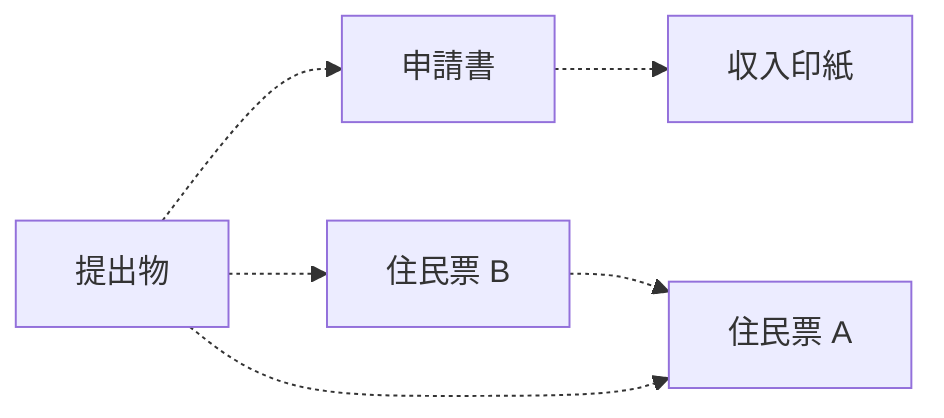

眠いから YouTube をテキトーに見て回って寝ることにする。

2:10 マリオメーカーのビデオで満足して就寝。

7:00 起床。納豆と米を食う。出勤。

7:40 現場。今日はゴミ出しがないのでヒマ。館内を丁寧に掃除するしかない。
久しぶりに雑巾なんか使ったりして。

10:05 撤収。この後すぐに用事があるので押上駅まで徒歩で移動。
本当は京成曳舟駅を使えば目的地まで一発で行けるのだが。

押上駅～蔵前駅～上野御徒町駅。ABAB 向かい側のビル六階の法テラスに移動。
時刻が早い。非常階段室で携帯電話をいじって時間つぶし。

11:20 法テラス上野。勝手にゴージャスな施設を想像していたが、実際は事務所という感じだ。
法律相談というか、手続きの質問をする。個室で弁護士先生と会話するだけ。

11:50 終了。退場。上野御徒町に戻る。都バスで移動したいのだが、バス停が見当たらない。

上野御徒町駅～蔵前駅～本所吾妻橋駅。区役所へ向かう。

12:10 福祉事務所会計課。頂き過ぎた生活保護費を返納。1475 円。

退庁。隅田公園を久しぶりに通り抜け、三ツ目通りのバス停へ移動。
一分前にバスが発車していやがる。相変わらず私のツキは細い。水戸街道を徒歩だ。

イトーヨーカドー曳舟店。体温チェック。

12:50 曳舟の部屋。PC を開く。おやつ。さらなる用事が増えたが、いったん頭を休めたい。
自分の意志とまったく関係のないところから生じる用事のなんと多いことよ。

13:30 歯を磨く。気分を鎮めるためにノート作業。変数のあたりまで。

15:15 寝る。

20:35 起床。外出。

21:00 コモディイイダ東向島店。587 円。

* 肉焼売中華弁当
* ツナチェダー
* 小粒納豆 (3)

曳舟の部屋に戻る。入浴。

21:35 風呂から出る。PC を開く。晩飯。

* [&#x23;721 新創世記ラグナセンティ Crusader of Centy BGM ギターメドレー - YouTube](https://www.youtube.com/watch?v=_mZ07rwFkac)
* [裁判所 - Courts in Japan](https://www.courts.go.jp/):
  * サイト名がシンプルなのは良い。
  * 欲しい書類テンプレが PDF でダウンロードできるようだが、ファイルサイズが非常識だ。
    三桁キロバイトはないだろう。
* [Chaos Field - Secret 5-1 M logo - YouTube](https://www.youtube.com/watch?v=_zHo5WW8THc):
  この人にしては珍しくビデオの description がない。

調べ物が多い。収入印紙の入手法、特殊な住民票の入手法など。
役所のウェブページは画面に出てくるのがなぜか遅い。

コンビニ交付に対応している書類ではあるが、即発行ではない。役所の窓口に行くほうが早い。
役所が二つあり、週末を挟むが、それでも直接行って請求するのが最も早い。

また、公的書類に依存関係があることを注意する。
先に住民票 A を入手してから次の役所で住民票 B を入手する。最終的に A と B を両方裁判所に提出する。

PDF を USB 棒に保存しておく。手書きになるのでコンビニで印刷しておく。
こちらは書類と情報を得てからでいい。

23:00 調べ物はもういい。あとは自習。

* [【ARENA】第3回オンラインARENA最終日！誰かいますかー？【音ゲー / beatmania IIDX / CastHour / DOLCE.】 - YouTube](https://www.youtube.com/watch?v=sgebOwUm2Fo)

まだ変数の章の途中だが、日付が変わる。
