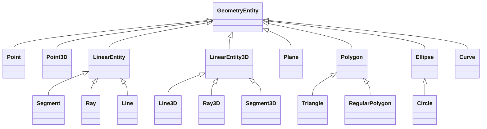

引き続き SymPy ノートを直す。内容は変更しない。気が向いたらグラフを描くこともする。

1:00 ビルドと目視確認をやっていったん終わる。クラス図は Mermaid を更新したら取りかかればいい。
そして排便チャレンジ。

1:40 Twitter Tool のノートも直しておく。これは API key を紛失してから全然使っていない。

イルベロのビデオを研究。点アイテムの実際の得点は？
コマ送りを駆使して確認する。

2:20 けっこう手間がかかる。事実を記す。点（小）について：

* 素点は 50 しかない。
* ただし、取得時に自機のレベルと取得鍵個数が考慮される。
  例えばレベルが 95, 75, 111 で鍵を 9 個得ているならば、次の値が得点になる：

  $$
  50 \times (95 + 75 + 111) \times 9 = 14500.
  $$

ということは、点（小）取得によるスコアの上限は 225 万点だ。
狙いは百億点なのでほとんど無視できることになる。

点（大）のスコアが不明なまま今晩は終わりそうだ。
アイテム取得前後のスコアの差を上記公式にあてはめると値が 50 である項が整数にならない。
これは妙だ。どのシーンで試験してもダメだ。このビデオではスコアがにじんでいるから誤読したか。

いったんあきらめて YouTube を開く。この時間だから短いのを。

[悪魔城ドラキュラ (FDS) 全クリア (ノーダメージ / 隠しアイテム取得) - YouTube](https://www.youtube.com/watch?v=OLWSgNiS_RE):
これはいいプレイ。隠しアイテムをすべて出現させているのでは。

3:35 消灯。就寝。

8:05 起床。納豆とレーズンロール五個を食す。歯を磨く。PC を開く。時間つぶし。

真夜中に考えていた Mermaid 作業を今行う。ビルドした HTML を見たらすでに最新版エンジンで動作している。
当日記はどうかな：

やはり真夜中は頭がボケている。前日のタイトルがバグっていたのを修正。

9:05 PC を閉じて外出。押上駅～東日本橋駅～小川町駅。ベンチで休憩して時間調整。

10:00 秋葉原 HEY 二階。Edy に千円チャージしてから遊ぶ。
イルベロとビートマニアをそれぞれ五クレぶん遊ぶ。

ビートマニアの段位認定九段は撤退したほうがいいかもしれない。
STEP UP モードで四曲目をチェックしたらレベル 12 ではないか。これは私の手に余る。
基本のレベル 10 ランプ作業に戻すべきだ。

イルベロはやることが二つある。三面と四面の五鍵面近傍の立ち回りを大幅変更。
スコアの高い地上敵がいるはずなので、それをチェックする。
ビデオで見る以上に三面のそれを倒すのが難しい。中型機の部品剥がしも並行しないといけない。

13:40 退店。小川町駅～東日本橋駅～押上駅。

14:20 ビッグエー墨田業平店。454 円。

* ポテチのり塩
* カレーピラフ風おにぎり
* コッペパンブルーベリー
* カレーヌードル
* 野菜ジュース (900)

イトーヨーカドー曳舟店。体温チェック。

曳舟の部屋。PC を開いて即おやつ。

[【ファミコン】仮面ライダー倶楽部　さぁ今こそ変身しよう！ - YouTube](https://www.youtube.com/watch?v=RxaGne9QXnQ):
道中もボス戦も単調に見えるのだが、やっているほうはそうではないのか。
戦闘画面やステータス画面の色彩感覚がモダン。

15:25 歯を磨く。

[【SFCレトロゲーム】　麻雀飛翔伝　哭きの竜　前編【ゆっくり実況】 - YouTube](https://www.youtube.com/watch?v=u5jligsrIjg):
二人打ちはチートイがいい説を提唱しているが？

16:30 消灯。就寝。

22:10 目が覚めるが、こんな時間ではもうそのまま眠り続けるほうがいい。
