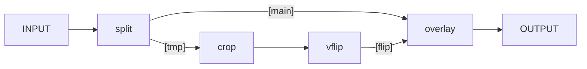

0:10 級数のノートが一段落ついたが、数式をタイプしまくりで疲労が蓄積する。
VS Code のスニペッツをもっと拡充しないと効率が上がらない。

[FFmpeg] に戻る。フィルターを習得したい。
[FFmpeg Filters Documentation](https://ffmpeg.org/ffmpeg-filters.html)
にある次のコマンドライン例を読み解いてみたい：

```console
ffmpeg -i INPUT -vf "split [main][tmp]; [tmp] crop=iw:ih/2:0:0, vflip [flip]; [main][flip] overlay=0:H/2" OUTPUT
```

アスキーアートで説明されているものを改めて模式化する：



さっきの新宿中央公園ビデオを `INPUT` として実際に確かめる。上下が鏡写しになった映像が
`OUTPUT` として得られる。

* 角括弧パターンはラベルを指定
* `split`, `crop`, `vflip`, `overlay` はいずれもフィルター
* フィルター `split` はおそらくラベル複数を「出力」とする
* フィルター `overlay` はおそらくラベル複数を「入力」とする
  * 引数 `0:H/2` を取るらしい
* フィルター `crop` は映像の切り取りだろう
  * 引数 `iw:ih/2:0:0` を取るらしい
* フィルター `vflip` は垂直方向にひっくり返すのだろう
  * 引数はないらしい

引数の説明が下の方にある。

* `crop=iw:ih/2:0:0` は `=出力幅:出力高:出力位置x:出力位置y` の意。`iw`, `ih`
  はそれぞれ入力幅と入力高。座標系原点は左上だろうから（画像なので）、映像の上半分を切り抜く（残るほう）。
* `overlay=0:H/2` は主映像に重ね合わせる映像の座標を設定する。
  貼り付ける位置は画面の下半分ということになる。

以上の推論が正しいことを確認する。先ほどのコマンドラインの引数を微調整して出力を目視で検証する。
四分の一を切り取って四分の三の位置に貼り付けるなど。

今日のところは上述の単純なフィルターを理解したという成果で満足しておく。

YouTube を聴きながら麻雀の練習。勝てない。

4:00 就寝。

9:30 起床。納豆とガーリックフランスを食す。歯を磨く。

図書館へ行こうとするも雨のようなのでやめる。PC を開いて時間を潰す。

[Real Analysis](https://www.youtube.com/playlist?list=PLBh2i93oe2quABbNq4I_-hyjhW8eOdgrO) 序盤の概要をチェックする。
証明抜きの定理を扱う回を二つ見つける。自分で証明を補完したい。

12:15 おやつ。まだビデオをチェックし続ける。前半だけでいいか。

12:50 歯を磨く。[FFmpeg] 調査に切り替える。フィルターの前に本体ドキュメントの
Examples を優先するべきだった。

いつの間にか寝る。

19:30 起床。まだ雨が降っているのか。携帯電話をチェック。そろそろやむようだが傘をさして外出。

20:20 コモディイイダ東向島店。570 円。

* にぎり寿司
* 真アジフライ (2)
* バターロール (5)

曳舟の部屋。排便チャレンジから入浴へ。

風呂を出る。PC を開く。休止状態から復帰すると WSL が死ぬのは何だろうか。晩飯。

* [ファミコン　TAO-道- ＃1 - YouTube](https://www.youtube.com/watch?v=8jPQ_uVrEws):
  このプレイヤーも戦闘システムを把握していないようで、闘コマンド連打しかしない。
* [ファミコン　TAO-道- ＃2 - YouTube](https://www.youtube.com/watch?v=sgo1oFKl7Rc):
  したがってチャンスを使い切って全滅。おかげで復活時の進行を初めて観ることができた。

22:15 貴重なものを見たところで歯を磨く。[FFmpeg] をやる。Examples 解読続き。

パロディウスのワーオを異なるビットレート (`-b:a`) に変換して聴き比べる。如実に違う。
画像からビデオを生成するコマンドを習得する。イルベロの年間スコア総集編の実現が可能になった。
最後に、複数ビデオを入力にして複数ストリームを単一ビデオに出力する方法を知る。

例が二つ残っているところで日付が変わる。

[FFmpeg]: https://ffmpeg.org/ffmpeg.html
