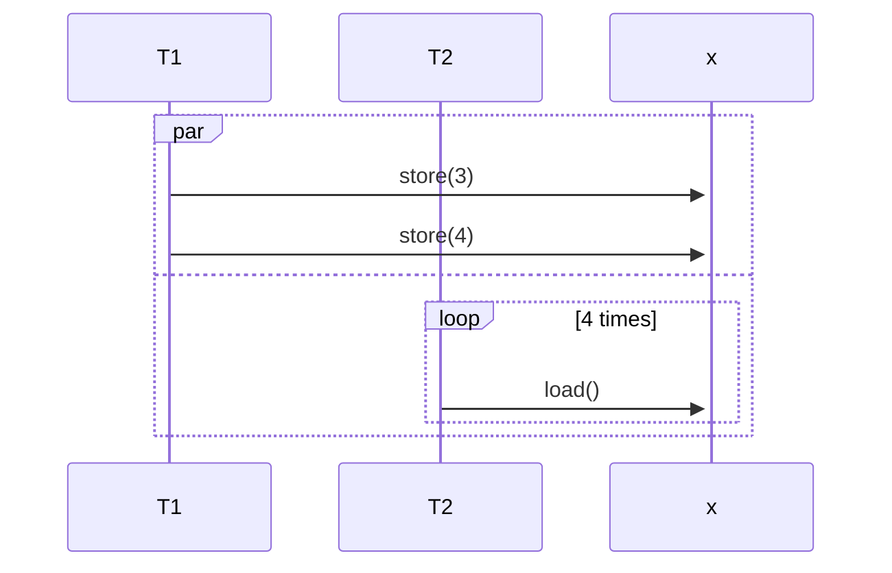

0:15 ゲーム開始。[FOUR CURSES(アルファ版)][dtp23a] パンデモニウム耐久。

2:00 ビビアンが炎の壁を発動すると LP が 1 減る気がする。ビデオ撮影。
ちょうどフレイムブラスターが登場するので試す。再現する。
不具合かと思ったが、再生してよく画面下部のテキストを読むと、確かにそう書いてある。
この戦闘バランス調整はすごい。並の設計者はここまで思い至らない。

YouTube を垂れ流して麻雀の練習。

3:35 消灯。就寝。

11:10 起床。頭がフラフラする。そういえばゆうべの風呂からおかしい。
納豆をまず食い、カップ麺に湯を入れる。コッペパンをかじりながら PC の画面を開く。
天気予報は雨。

12:00 歯を磨く。C++ 同時性プログラミング続き。難しい概念の注釈追加をしたり、
アスキーアートをきちんと図式化したりして時間がかかる。

こういう機会でもないと並行実行の sequence diagram なぞ作図しないからやっておく。

14:50 『高速上手』第七章を終わる。ひどく疲れているので寝る。フラフラする。

19:40 起床。外出。

イトーヨーカドー曳舟店。体温チェック。

20:10 コモディイイダ東向島店。591 円。

* レバニラ弁当
* 和風サラダ

曳舟の部屋。入浴。

風呂を出る。PC を開く。インターネットをチェックしつつ晩飯。

* [ドラが沢山のインフレ東風にチャレンジしてきました【心斎橋フュージョン】 - YouTube](https://www.youtube.com/watch?v=zgTh-8UsCD8):
  二ゲーム目の東二局、私が打っていたらピンズを外してテンパイを逃していた。
* [【shogi】藤井聡太竜王が参戦！A級順位戦ってどんなところ？参戦棋士は？Sota Fujii Ryu-o enters the Class-A League!【English Sub】 - YouTube](https://www.youtube.com/watch?v=GldJw0vHTxk):
  一人だけ数字がヤバいことがはっきりと見える。

21:35 歯を磨く。『高速上手』ノートを続ける。第八章は空っぽなので自力で埋めるか。

[ワンモアが出たらしいので一発エクハする - YouTube](https://www.youtube.com/watch?v=sBAZ0mFeyno):
BGM とする。MIKAMO プロは 1P 側だから、評価をするならこれまで見てきたクリア例とは別にしないといけない。

ファイルシステム API ということで、小難しい細部への言及が必要だ。
著者は執筆が面倒になったのだろう。私もリファレンスを当たるのにべらぼうな時間がかかってしまう。

[dtp23a]: https://wodifes.net/game/show/520
