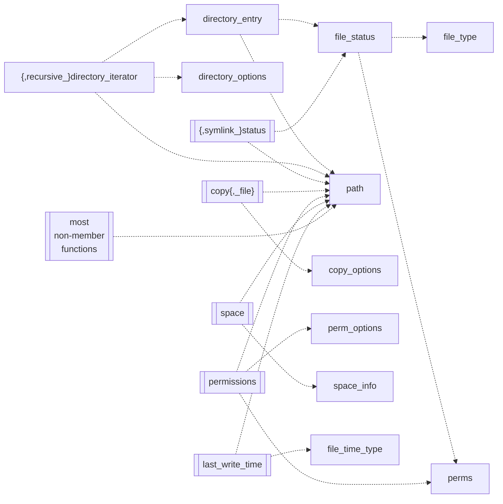

0:10 排便チャレンジ。するとどうしたことだろう。またぞろ頭がフラフラとする。
TAO (VAP, 1989) のキラキラ組大本夫人のように甘露でも舐めれば治るだろうか。

仕方がないのでゲームを諦めてファイル整理。

3:00 消灯。就寝。睡眠状態は普通。

7:05 起床。納豆とおにぎり二個を食う。歯を磨く。出勤。

7:45 現場。資源ゴミ出し。ゴミ整理。恒例の賞味期限ちょい切れ（一日とか）の食い物をまとめて捨てる輩がいる。
館内を上の階から掃除機で駆け廻る。自転車置場をモップで撫でる。
残り時間で砂利の雑草むしり。クローバーは抜きにくい。

10:05 撤収。

10:20 ビッグエー墨田京島店。345 円。

* コッペパンブルーベリー
* カレーヌードル
* サラダミックス
* バターロール (6)
* 小粒納豆 (3)

ひきふね図書館。月刊文藝春秋 2023.3 号を速読。
おそらくいちばん面白い記事は柄谷行人先生のインタビュー。
絵に描いたような頭のいい人の話し方。

シメに月刊マックファン 2023.4 号。鈴木みそ先生は定期的に老人ネタを描く印象がある。
相変わらずハイセンス。

イトーヨーカドー曳舟店に移動。体温チェック。上旬ぶんの体温表が出来上がる。
しかしハガキを投函するのを忘れて部屋に戻ってしまう。

曳舟の部屋。PC を開く。[転職・求人情報サイトの type](https://type.jp/) 作業。
求人応募をするかどうかは微妙。しない。

12:00 おやつ。空腹なのでさっさと食う。

[【みんなで運動】KAC女性部門覇者のPOさんとKACの舞台常連のUN-LIMさんとで健康になります！！！【音ゲー / DanceDanceRevolution A3 / DOLCE.】 - YouTube](https://www.youtube.com/watch?v=e_mSC_qDC6s):
では改めて視聴。DDR 回はゲストを呼ぶのを定着させると発展性があっていいと思う。
プレイでゲストの引き立て役に徹して偉い。

12:25 歯を磨く。C++ ``std::filesystem`` ノート。ゆうべ寝床で思い付いた攻略法を実践に移す。
依存グラフを描いて矢印の先がもっとも集中している要素からやるのがいい。

もちろんこれが全体ではない。こうして見ると `path` が最重要コンポーネントだ。
グラフの右側にあるものほど先に理解する必要がある。左側にあるものほど応用の度合いが高い。

15:45 就寝。

20:05 起床。外出。水戸街道で昼のハガキを投函。

20:30 コモディイイダ東向島店。494 円。

* ハンバーグ＆カツ弁当
* ポテトサラダ M

曳舟の部屋。排便。もっと出ていい。入浴。

風呂から出て PC を開く。晩飯。

* [オープン前の吉祥寺の雀荘で元同僚の鉄強メンバーと戦ってきました【三人麻雀レイズ】 - YouTube](https://www.youtube.com/watch?v=TcGWjV8-SF0):
  赤が 2 と 8 にも入っている珍しいルール。手牌を見ると端の牌が浮いていることがあって面白い。
* [【リベンジ】ボコされたワンモアEXTRA今日こそクリアしますあとdica dicaもやります【音ゲー / beatmania IIDX / RESIDENT / DOLCE.】 - YouTube](https://www.youtube.com/watch?v=5gj06SluIiY):
  間に合った。調子が良いようだからなんとかなるだろう。

22:05 歯を磨く。`std:filesystem` を早く終わらせたい。

23:50 なんとか終わる。[Mermaid.JS] を使ったから少しは手抜き感が払拭できたろうが。

[ファイナルファンタジータクティクス PS版 #14 昔の記憶を頼りにゲームクリアまでプレイ【FFT】【ゆっくり実況】 - YouTube](https://www.youtube.com/watch?v=XDej_UBx-M0):
時間いっぱいまでチェック。

[Mermaid.JS]: https://mermaid-js.github.io/mermaid/
