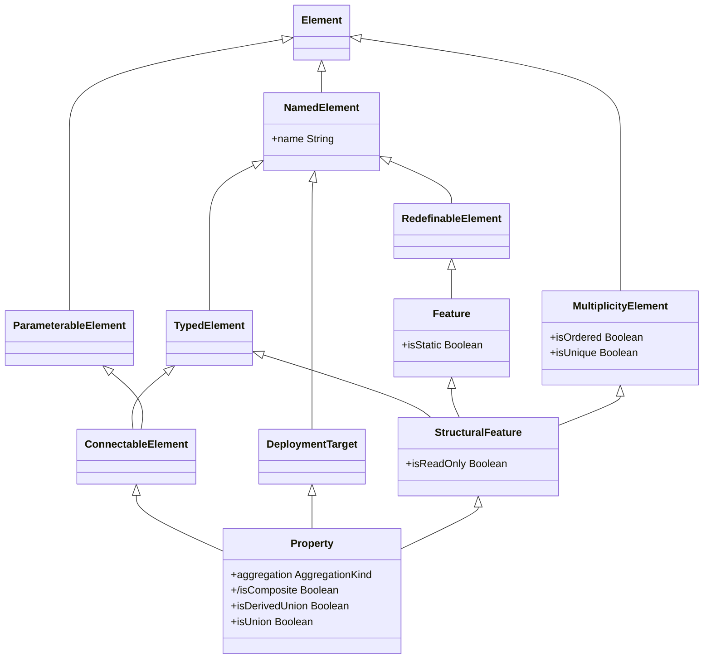

今宵もメタルマックスからか。

[【ゆっくり実況】SFCメタルマックス2 #01【レトロゲーム】 - YouTube](https://www.youtube.com/watch?v=lNDQPhlX3GA):
オープニング～最初の町探索。カスタマイズがウリのゲームだから、スーファミでは珍しいボタン設定、メニュー設定がある。
開発陣は只者ではないようだ。

UML の Association 周りの理解を深める。しかし、Property の (derived) union を調べるのが先決なのか？



`Property::isComposite` の仕様を読んで思い出したが、derived なんとかというのは、
そのなんとかが他の何かから導出されることを意味するらしい。
この場合は

```text
isComposite == (self.aggregation == AggregationKing::composite)
```

だ。親クラスから派生したなんとかとかいう意味は、一般的にはない。

2:00 調査だけでこんな時刻になる。寝るか。

7:05 起床。納豆とガーリックフランスを食す。歯を磨く。出勤。
暑さのせいですばやさが下がっている。

7:50 現場。資源ゴミ搬出と処理。館内を掃除機で吸い回す。道路の鳥の糞落とし。
またぞろ本部から訪問。今回は施設周りの図面を確認しに来たようだ。すぐに用事が済むらしい。

10:10 撤収。本部メンバーとすれ違わぬように、ビッグエーを諦める。

10:30 オーケー曳舟店。ちょうど昨日行っていなかったし良かった。692 円。

* おにぎり梅
* 完熟トマトピザ
* カットキャベツミニ
* 絹豆腐 (3)
* 小粒納豆 (4)
* 玉子粥 (2)
* 和風サラダ

曳舟の部屋。水浴び。洗濯。白ブリーフ一丁で PC を開く。

11:30 洗濯物を干す。

12:00 軽食。おにぎり、ピザパン、キャベツ、豆腐。

12:20 PC を閉じる。歯を磨く。手許にある『入門 HTML5』を読む。

13:00 昼寝。窓を閉じる。砂漠の車は窓を閉じるというではないか。

15:45 起床。外出。

スカイツリー展望台一階トイレ。排便。エレベーター前のベンチで時間調整休憩。

17:40 押上駅前バス停～錦糸公園前。

18:00 タイトー F ステーションオリナス錦糸町店。MJ プロ卓東風戦 5 クレ。
手なりで打っているだけで浮くとは、珍しくツキが細くない。

```text
【SCORE】
合計SCORE:+93.8

【最終段位】
四人打ち段位:雀聖 幻球:12

【7/26の最新8試合の履歴】
1st|---**-*-
2nd|**-----*
3rd|--------
4th|--*--*--
old         new

【順位】
1位回数:4(36.36%)
2位回数:4(36.36%)
3位回数:0(0.00%)
4位回数:3(27.27%)
平均順位:2.18

プレイ局数:48局

【打ち筋】
アガリ率:25.00%(12/48)
平均アガリ翻:2.42翻
平均アガリ巡目:10.08巡
振込み率:10.42%(5/48)

【7/26の最高役】
最高役のデータがありません。最高役は、跳満以上のアガリが対象となります。
```

20:35 カスミオリナス錦糸町店。432 円。

* 讃岐うどん (2)
* イカ唐揚げ

曳舟の部屋。入浴。安物のカミソリがボロボロに錆びている。

風呂から出る。白ブリーフ一丁。PC を開く。

* [【ファミコン】まじかるタルるートくん２　まじかよ！！ - YouTube](https://www.youtube.com/watch?v=aUbZyaJmdjc):
  なちょす先生、これは 2 を先にやるべきだった。
* [絶妙のタダ捨て▲4四香炸裂！最後は圧巻23手詰　藤井聡太王位ｰ佐々木大地七段　伊藤園お～いお茶杯第64期王位戦第3局ハイライト　主催：新聞三社連合、日本将棋連盟） - YouTube](https://www.youtube.com/watch?v=Z66QsDu_weU):
  BGM にする。

22:05 歯を磨く。UML の知識整理。関連端子制約周り。
Fig. 7.3 の TemplateParameter と ParameterableElement の間にある関連同士に継承関係のようなものが見えるのだが？

[【BPL S3 IIDX】レギュラーステージ1st 第5試合 TAITO STATION Tradz vs GiGO/ 第6試合 GAME PANIC vs レジャーランド - YouTube](https://www.youtube.com/watch?v=qDGhLZxRS4g):
ラジオとして聞く。
