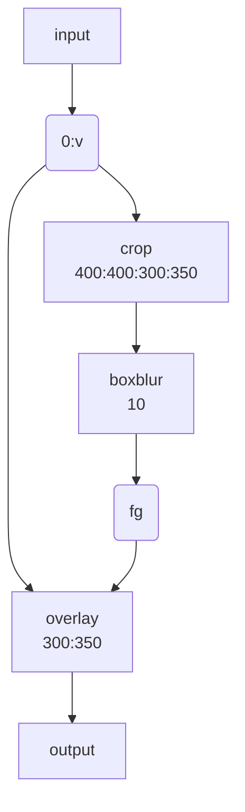

映像の空間的に、または時間的に一部をぼかす方法を記す。

## 考え方

オリジナルの映像の一部を矩形に「クリップボード」にコピーし、ぼかしフィルターで加
工する。加工した映像矩形を元映像の同じ位置に「貼り付ける」というのが基本的な考え
方だ。コマンドラインも比較的単純な構造になる。オプション `-filter_complex` の引
数だけを抜粋したものを示す：

```text
ffmpeg -i input.mp4 \
  -filter_complex "
    [0:v]crop=400:400:300:350,boxblur=10[fg];
    [0:v][fg]overlay=300:350[v]" \
  -map "[v]" output.mp4
```

模式化しておく：



* `crop=400:400:300:350`: 座標 (300, 350) を原点とする矩形 400x400 を crop するの意。
* `overlay=300:350`: オーバーレイ座標。
* `boxblur=10`: ぼかしの強度。

ぼかしを矩形の周囲にしたい場合は全域を `boxblur` した絵にオリジナルの矩形を
`crop` したものを `overlay` すればいい。

## 類似フィルター

* `boxblur`
* `dblur`
* `gblur`
* `smartblur`
* `varblur`

## 参考

* [Blur a Video using FFmpeg's BoxBlur Filter - OTTVerse](https://ottverse.com/blur-a-video-using-ffmpeg-boxblur/)
* [How to Apply a Gaussian Blur to a Video with FFmpeg - Bannerbear](https://www.bannerbear.com/blog/how-to-apply-a-gaussian-blur-to-a-video-with-ffmpeg/)
