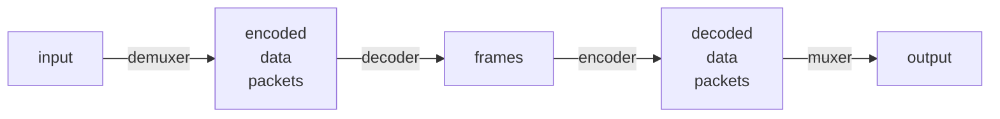
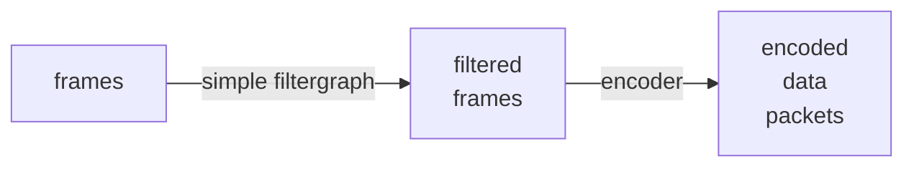
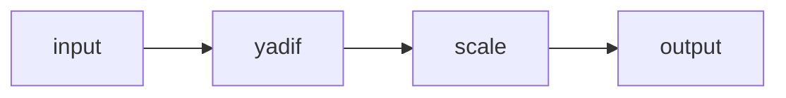
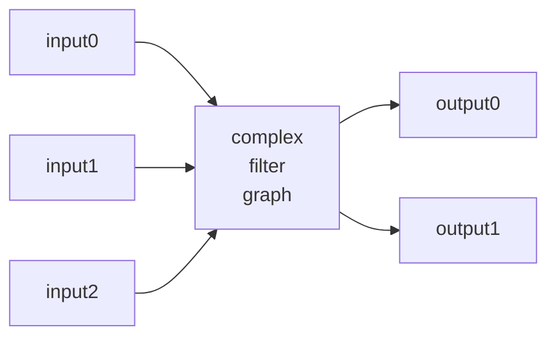
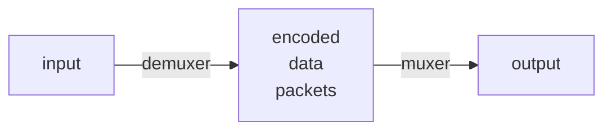

公式文書の第三章のノート。

FFmpeg コマンドパイプラインは次のグラフのように表される：



1. `ffmpeg` は libavformat ライブラリーを呼び出して入力ファイルを読み、それらか
   らエンコードされたデータを含むパケットを得る。入力ファイルが複数ある場合もあ
   る。
2. エンコード済みパケットは、decoder に渡される。非圧縮フレームを生成し、フィル
   ターによってさらに処理することができる。
3. フィルターの後、フレームは encoder に渡され、それらをエンコードし、エンコード
   済みパケットを出力する。
4. 最後に、エンコード済みパケットは muxer に渡され、出力ファイルに書き出される。

## Filtering

エンコードする前に libavfilter ライブラリーのフィルターを使って生の音声・映像フ
レームを処理することができる。フィルターの連鎖がフィルターグラフを形成す
る。`ffmpeg` はフィルターグラフを simple と complex の二種類に分類して扱う。
利用者の立場からするとコマンドラインの書き方が変わってくる。後者のほうが文字通り複雑になる。

### Simple filtergraphs

入力と出力がそれぞれ一つずつあり、両方とも同じ型である filtergraph を simple graph という。
最初の図では、decode と encode の間に段階を追加するだけで、表現することができる。



単純フィルターグラフは、ストリームごとに `-filter` オプションで設定する。

* `-filter:v`, `-vf`
* `-filter:a`, `-af`

例えば次のようなコマンドでは、オプション `-vf yadif,scale=256:224` 部分が simple
filtergraph を構成している：

```console
ffmpeg -i input.mp4 -vf yadif,scale=256:224 output.mp4
```

ここでは映像フィルター `yadif` と `scale` を順番に適用している。
カンマでフィルターを区切って列挙するだけでいい。
各フィルターには固有の引数を与えることもある（この例では `scale` でそうしている）。
どのフィルターオプションにおいても次の書式になると思っていい：

```text
filtername=param1=arg1:param2=arg2:...
filtername=arg1:arg2:...
```

このコマンドを図式化したものを記す：



フレームのプロパティーを変更するフィルターもあるが、普通はフレームの内容には触れ
ない。例えば、`fps` フィルターはフレーム数を変更するものの、その内容には触れな
い。もう一つの例は `setpts` フィルターだ。これはタイムスタンプを設定するだけで、
それ以外はフレームを変更せずに通過させる。

### Complex filtergraphs

入出力ストリームが複数あり得るものを complex filtergraph という。模式的に書くと例えば：



Complex filtergraph はオプション `-filter_complex` で構成する。その性質上、単
一ストリームやファイルに一義的に関連付けることができないため、このオプションは
global だ。

オプション `-lavfi` は `-filter_complex` と同じだ。

複雑なフィルターグラフの明らかな例は `overlay` フィルターだ。二つのビデオ入力と一
つのビデオ出力を持ち、一方のビデオが他方のビデオの上に重なっているものだ。その
音声版に相当するのが `amix` フィルターだ。例については別途述べる。

TODO: Filters ノートへリンク？

## Stream copy

ストリームコピーとはオプション `-codec: copy` で機能するモードだ。意味としては基
本図式の decoder と encoder の段階を省き、demuxer と muxer のみを機能させるとい
うことだ。用途としては、コンテナー形式を変換したり、コンテナーレベルのメタデータ
を変更したりするものだ。この状況での `ffmpeg` コマンドパイプラインの基本図式は次
のように単純になる：



符号化や復号化処理がないため、たいへん高速で品質劣化もない。
また、フィルターを適用することは当然不可能だ（フィルターは非圧縮データに対して機能する
ものだ）。

## 参照

* [ffmpeg Documentation](https://ffmpeg.org/ffmpeg.html)
* [Ffmpeg: How to deinterlace video - OneLinerHub](https://onelinerhub.com/ffmpeg/how-to-deinterlace-video)
