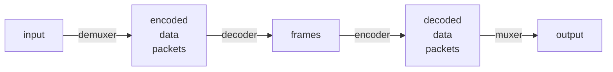
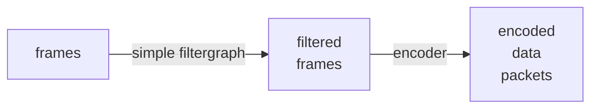
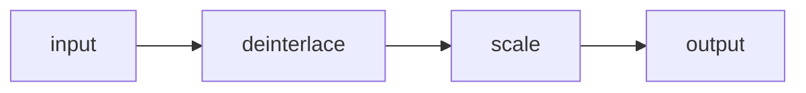
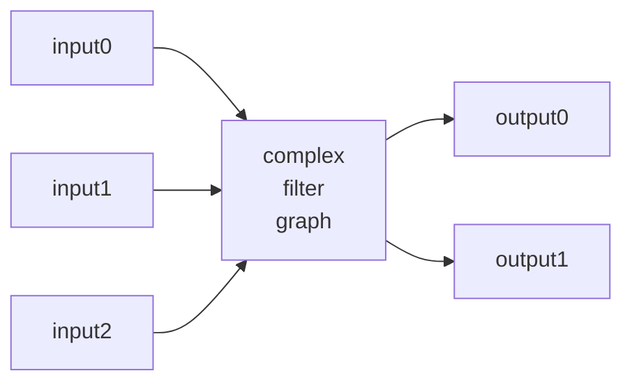
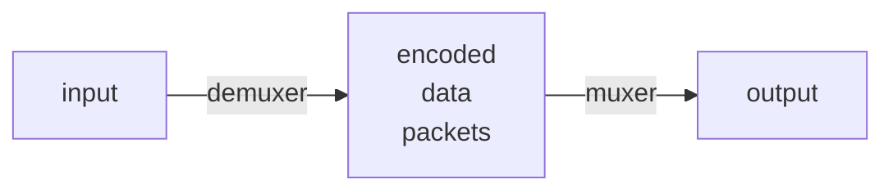

[ffmpeg Documentation](https://ffmpeg.org/ffmpeg.html#Detailed-description)
注釈ノート。

FFmpeg コマンドパイプラインの基本形は次のグラフのように表される：

1. `ffmpeg` は libavformat ライブラリーを呼び出して入力ファイルを読み、それらか
   らエンコードされたデータを含むパケットを得る。入力ファイルが複数ある場合もあ
   る。
2. エンコード済みパケットは、decoder に渡される。非圧縮フレームを生成し、フィル
   ターによってさらに処理することができる。
3. フィルターの後、フレームは encoder に渡され、それらをエンコードし、エンコード
   済みパケットを出力する。
4. 最後に、エンコード済みパケットは muxer に渡され、出力ファイルに書き出される。

## Filtering

エンコードする前に libavfilter ライブラリーのフィルターを使って生の音声・映像フレームを処理することができる。
フィルターの連鎖がフィルターグラフを形成する。フィルターグラフには simple と complex の二種類がある。

### Simple filtergraphs

入力と出力がそれぞれ一つずつあり、両方とも同じ型であるを simple graph という。
最初の図では、decode と encode の間に段階を追加するだけで、表現することができる。

単純フィルターグラフは、ストリームごとに `-filter` オプションで設定する。

* `-filter:v`, `-vf`
* `-filter:a`, `-af`

映像フィルターの例を図式化したものを記す：

フレームのプロパティーを変更するフィルターもあるが、普通はフレームの内容には触れ
ない。例えば、`fps` フィルターはフレーム数を変更する、その内容には触れない。もう
一つの例は `setpts` フィルターだ。これはタイムスタンプを設定するだけで、それ以外
はフレームを変更せずに通過させる。

### Complex filtergraphs

複雑なフィルターグラフとは、単純なフィルターグラフでないフィルターグラフだ。
入出力ストリームが複数あり得る。

複雑なフィルターグラフはオプション `-filter_complex` で構成する。その性質上、単
一ストリームやファイルに一義的に関連付けることができないため、このオプションは
global だ。

オプション `-lavfi` は `-filter_complex` と同じだ。

複雑なフィルターグラフの簡単な例は `overlay` フィルターだ。二つのビデオ入力と一
つのビデオ出力を持ち、一方のビデオが他方のビデオの上に重なっているものだ。その
音声版に相当するのが `amix` フィルターだ。

## Stream copy

コンテナのフォーマットを変更したり、コンテナレベルのメタデータを変更したりすると
きに便利です。上の図は、この場合、次のように単純化されます。

ストリームコピーとはオプション `-codec: copy` で機能するモードだ。意味としては基
本図式の decoder と encoder の段階を省き、demuxer と muxer のみを機能させるとい
うことだ。用途としては、コンテナーの format を変換したり、コンテナーレベルの
metadata を変更したりする。 FFmpeg コマンドパイプラインの基本図式は次のように単
純になる：

符号化や復号化処理がないため、たいへん高速で品質劣化もない。

フィルターを適用することは当然不可能だ。フィルターは非圧縮データに対して機能する
ものだ。

----

* TODO: libavformat を調べる
* TODO: libavfilter を調べる
* TODO: 簡単な実例を試す
