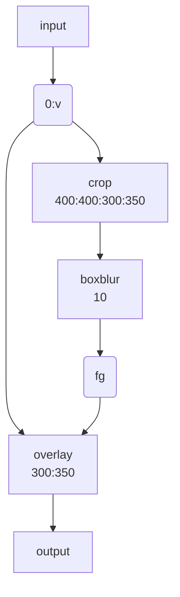

## Video and Audio grabbing

割愛。WSL では動作確認できない。

## X11 grabbing

割愛。WSL では動作確認できない。

### Video and Audio file format conversion

`ffmpeg` が対応している形式なら何でも入力たり得る。使えそうな例を拾っていこう。

----

入力オプション `-s size` でコマの寸法を指定しながら音声ファイル `a.wav` と YUV
生映像ファイル `a.yuv` を MPEG ファイル `a.mpg` に変換する：

```console
ffmpeg -i a.wav -s 640x480 -i a.yuv a.mpg
```

----

`a.wav` をサンプルレート 22050Hz の MPEG 音声に変換する。
出力オプション `-ar rate` で sampling rate を指定する：

```console
ffmpeg -i a.wav -ar 22050 a.mp2
```

----

複数のフォーマットに同時に encode することができ、入力ストリームから出力ストリー
ムへの写像を定義できる：

```console
ffmpeg -i a.wav \
    -map 0:a -b:a 64k a.mp2 \
    -map 0:a -b:a 128k b.mp2
```

オプション `-map file:index` は各出力ストリームにどの入力ストリームを使うかを出
力ストリームの定義順で指定する。したがって `-map 0:a` の意味は「入力 `0` である
`a.wav` から音声 (`a`) を指定する」だ。

オプション `-b:a bitrate` は音声ビットレートを指定する。

したがって、コマンドの意味は
「`a.wav` を 64kbits の `a.mp2` と 128kbits の `b.mp2` にそれぞれ変換する」だ。

----

ビデオから画像を抽出したり、多数の画像からビデオを作成したりすることが可能だ。
前者はこう：

```console
ffmpeg -i foo.avi -r 1 -s WxH -f image2 foo-%03d.jpeg
```

このコマンドはビデオ `foo.avi` から一秒間に一コマを抽出 (`-r 1`) し、ファイル名
`foo-001.jpeg`, `foo-002.jpeg`, ... で出力する。各画像を新しい `WxH` の値に合わ
せて伸縮する。

Note: オプション `-f image2` はこの場合は指定してもしなくても同じこと。

限られた数のコマを抽出したい場合は、上記のコマンドと `-frames:v` または `-t`
を組み合わせたり、`-ss` と組み合わせて、ある時点から抽出を開始するといい。

逆に、多数の画像からビデオを作成する場合はこう：

```console
ffmpeg -f image2 -framerate 12 -i foo-%03d.jpeg -s WxH foo.avi
```

* オプション `-f image2` は前述の demuxer 版。
* オプション `-framerate 12` は `image2` 固有オプションらしい。
  ビデオストリームのフレームレートを指定する。既定値は 25 とのこと。

`foo-%03d.jpeg` という構文は C の関数 `printf` で使う構文と同じだと思っていい。
整数を受け付ける書式しか適していないが。

画像列をインポートする際、オプション `-i` は `image2` 固有オプション
`-pattern_type glob` を選択することにより、シェル風ワイルドカードパターンの展開
(globbing) も内部で扱っている。例：

```console
ffmpeg -f image2 -pattern_type glob -framerate 12 -i 'foo-*.jpeg' -s WxH foo.avi
```

----

同種のストリームを多数出力にすることが可能。次のコマンドは出力ファイル
`test12.nut` に入力ファイルの最初の四ストリームを逆順に格納する：

```console
ffmpeg -i test1.avi -i test2.avi -map 1:1 -map 1:0 -map 0:1 -map 0:0 -c copy -y test12.nut
```

* オプション `-map 1:1` は `test2.avi` からストリーム `1` を選択する。
* オプション `-map 1:0` は `test2.avi` からストリーム `0` を選択する。
* オプション `-map 0:1` は `test1.avi` からストリーム `1` を選択する。
* オプション `-map 0:0` は `test1.avi` からストリーム `0` を選択する。
* オプション `-c copy` は decoding/encoding を行わない。
* オプション `-y` はプロンプトなしで出力ファイルを上書きする。

したがって、出力ビデオの映像と音声は `test2.avi` のものが「優先」して再生する。

----

固定ビットレートビデオ出力を強制する場合:


```console
ffmpeg -i myfile.avi -b 4000k -minrate 4000k -maxrate 4000k -bufsize 1835k out.m2v
```

* `-b 4000k` は「ビットレートを 4000k とする」の意。
* `-minrate bitrate`, `-maxrate bitrate` はオプション名の示唆するとおりだろうが、
  ヘルプに記載がない。`man ffmpeg-codecs` を当たると見つかる。
  固定ビットレート指定の場合には前者が有用。
  後者を用いるときには次の `-bufsize` 指定を必要とする。
* `-bufsize integer` はレート制御バッファーサイズをビット単位で指定する。
  今回の値はどうして出てきたのか不明。

## ottverse.com

ここから [What is FFmpeg? Usage, Benefits, and Installation Simplified - OTTVerse](https://ottverse.com/what-is-ffmpeg-installation-use-cases/)
を読解。

### スクリーンショットまたはサムネイルのための操作

```console
ffmpeg -i input.mp4 -ss 00:00:03 -frames:v 1 foobar.jpeg
```

### リサイズを伴う定期的なスクリーンショットまたはサムネイルを得る操作

```console
ffmpeg -i input1080p.mp4 -r 1 -s 1280x720 -f image2 screenshot-%03d.jpg
```

* `-r 1` は 1Hz を意味する。すなわち一秒間に一枚。
* `-s 1280x720` はこの寸法に縮尺する指定。映像が伸縮する。
* `-f image2` は先述のとおり。
* 引用元の述べる通り、フレーム精度は別に高くない。

### Cut, Trim, Extract

* オプション `-ss` を正しく理解する。入力と出力で分けて理解する。
* オプション `-t`, `-to` を理解する。時間と時刻の違いということだ。
  そして、両者はどちらか一方しか同時に用いることができない。

この手の操作時に同時に再エンコード処理を試みるとフレーム精度を得られる。
見返りに、エンコード処理は少なくない時間を要する。

```console
ffmpeg -i input.mp4 -ss 00:03 -to 00:08 -c:v libx264 -crf 30 trim_opseek_encode.mp4
```

* `-c:v libx264 -crf 30`: H.264 で encode し直す。
  `-crf 30` は H.264 encoding オプションであり、この値が小さいほど品質が良い。
* `-ss`, `-to` が出力側オプションであることに注意する。

再エンコードをしない場合は高速で切り抜ける：

```console
ffmpeg -ss 00:00:03 -i input.mp4 -to 00:00:08 -c:v copy -c:a copy trim_ipseek_copy.mp4
```

* 今度はオプション `-ss` が入力側に来ることに注意する。これが高速の理由の一つだ。
  ただし、それゆえにフレーム正確度が落ちる。
* オプション `-codec: copy` は decoding/encoding を省略するので高速だ。

### 垂直、水平、グリッドレイアウト

ビートマニアの V のビデオのようなことができる。

ビデオ二つを水平に並べる方法がある。次の条件を必要とする：

1. 両者の画面高が同じであること。
2. 両者のピクセルフォーマットが同じであること。

MP4 ビデオ二つを水平に並べるコマンドはこのようなものだ：

```console
ffmpeg -i input0.mp4 -i input1.mp4 -filter_complex "hstack=inputs=2" horizontal-stacked-output.mp4
```

ビデオを垂直に並べるには `hstack` の代わりに `vstack` を用いる。
入力の条件は方向を考慮して `hstack` に準じる。

どちらのフィルターにも引数 `shortest` がある。これを `1` にすると最短のビデオの長さに合わせる。

どちらの操作でも、何か黄色いメッセージが出てきたらオプション `-vsync 2` を併用してやり直す。

以上を組み合わせて 2x2 レイアウトを実現できる：

```console
ffmpeg \
   -i input0.mp4 -i input1.mp4 \
   -i input2.mp4 -i input3.mp4 \
   -filter_complex "
     [0:v][1:v]hstack=inputs=2[top];
     [2:v][3:v]hstack=inputs=2[bottom];
     [top][bottom]vstack=inputs=2[v]"
   -map "[v]" \
   finalOutput.mp4
```

演習：音声を復活させろ。

### ぼかし

映像の空間的または時間的一部をぼかす方法がある。

まずオプション `-filter_complex` の引数だけを抜粋したものを調べる：

```text
ffmpeg -i input.mp4 \
  -filter_complex "[0:v]crop=400:400:300:350,boxblur=10[fg]; [0:v][fg]overlay=300:350[v]" \
  -map "[v]" \
  output.mp4
```

模式化しておく：



* `crop=400:400:300:350`: 座標 (300, 350) を原点とする矩形 400x400 を crop するの意。
* `overlay=300:350`: オーバーレイ座標。
* `boxblur=10`: ぼかしの強度。

ぼかしを矩形の周囲にしたい場合は全域を `boxblur` した絵にオリジナルの矩形を
`crop` したものを `overlay` すればいい。

### Transition Effects

フィルター `xfade` を中心にパイプラインを組み立てる。

```console
ffmpeg \
  -i input0.mp4 \
  -i input1.mp4 \
  -filter_complex "xfade=transition=<FADE_TYPE>:
  duration=<TRANSITION_DURATION_IN_SECONDS>:
  offset=<OFFSET_RELATIVE_TO_FIRST_STREAM_IN_SECONDS>"
  output.mp4
```
