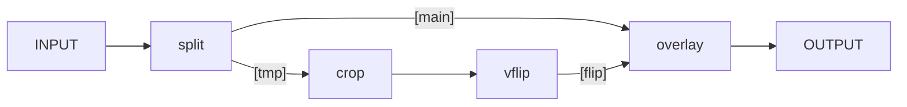

## Filtering Introduction

FFmpeg のフィルターは libavfilter ライブラリーで実装されている。
このライブラリーではフィルター一つで入力と出力を複数持つことができる。
説明のために次のような filtergraph を考える：

```console
ffmpeg -i INPUT -vf "split [main][tmp]; [tmp] crop=iw:ih/2:0:0, vflip [flip]; [main][flip] overlay=0:H/2" OUTPUT
```

本文でアスキーアートで説明されているものを改めて模式化する：



* 角括弧パターンはラベルを指定
* `split`, `crop`, `vflip`, `overlay` はいずれもフィルター
* フィルター `split` はおそらくラベル複数を「出力」とする
* フィルター `overlay` はおそらくラベル複数を「入力」とする
  * 引数 `0:H/2` を取るらしい
* フィルター `crop` は映像の切り取りだろう
  * 引数 `iw:ih/2:0:0` を取るらしい
* フィルター `vflip` は垂直方向にひっくり返すのだろう
  * 引数はないらしい

引数の説明が下の方にある。

* `crop=iw:ih/2:0:0` は `=出力幅:出力高:出力位置x:出力位置y` の意。`iw`, `ih`
  はそれぞれ入力幅と入力高。座標系原点は左上だろうから（画像なので）、映像の上半分を切り抜く（残るほう）。
* `overlay=0:H/2` は主映像に重ね合わせる映像の座標を設定する。
  貼り付ける位置は画面の下半分ということになる。

## タイムライン編集

フィルターによってはオプション `enable` がある。特定の時間区間だけフィルターを
ON にしたい場合に有用だ。簡単に述べると値が 0 でない場合フィルター自身が有効にな
る。そうでない場合、フレームは filtergraph 内の次のフィルターにそのまま送られ
る。

例：映像フィルター `smartblur` で `10` 秒から `3*60` 秒までに限って適用したい：

```text
smartblur=enable='between(t,10,3*60)'
```

評価式の構文は FFmpeg Utilities Documentation の Expression Evaluation を参照す
ること。

オプション `enable` を対応しているフィルターは次のコマンドで確認可能：

```console
ffmpeg -filters | grep -- '^ T'
```
