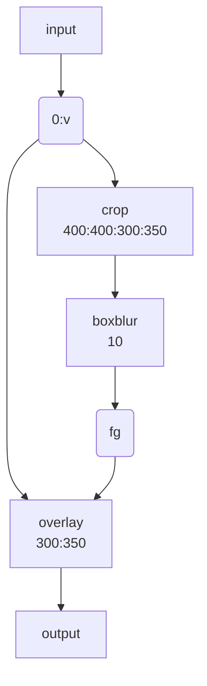

ここから [What is FFmpeg? Usage, Benefits, and Installation Simplified - OTTVerse](https://ottverse.com/what-is-ffmpeg-installation-use-cases/)
を読解。

## スクリーンショットまたはサムネイルのための操作

```console
ffmpeg -i input.mp4 -ss 00:00:03 -frames:v 1 foobar.jpeg
```

## リサイズを伴う定期的なスクリーンショットまたはサムネイルを得る操作

```console
ffmpeg -i input1080p.mp4 -r 1 -s 1280x720 -f image2 screenshot-%03d.jpg
```

* `-r 1` は 1Hz を意味する。すなわち一秒間に一枚。
* `-s 1280x720` はこの寸法に縮尺する指定。映像が伸縮する。
* `-f image2` は先述のとおり。
* 引用元の述べる通り、フレーム精度は別に高くない。

## Cut, Trim, Extract

* オプション `-ss` を正しく理解する。入力と出力で分けて理解する。
* オプション `-t`, `-to` を理解する。時間と時刻の違いということだ。
  そして、両者はどちらか一方しか同時に用いることができない。

この手の操作時に同時に再エンコード処理を試みるとフレーム精度を得られる。
見返りに、エンコード処理は少なくない時間を要する。

```console
ffmpeg -i input.mp4 -ss 00:03 -to 00:08 -c:v libx264 -crf 30 trim_opseek_encode.mp4
```

* `-c:v libx264 -crf 30`: H.264 で encode し直す。
  `-crf 30` は H.264 encoding オプションであり、この値が小さいほど品質が良い。
* `-ss`, `-to` が出力側オプションであることに注意する。

再エンコードをしない場合は高速で切り抜ける：

```console
ffmpeg -ss 00:00:03 -i input.mp4 -to 00:00:08 -c:v copy -c:a copy trim_ipseek_copy.mp4
```

* 今度はオプション `-ss` が入力側に来ることに注意する。これが高速の理由の一つだ。
  ただし、それゆえにフレーム正確度が落ちる。
* オプション `-codec: copy` は decoding/encoding を省略するので高速だ。

## 垂直、水平、グリッドレイアウト

ビートマニアの V のビデオのようなことができる。

ビデオ二つを水平に並べる方法がある。次の条件を必要とする：

1. 両者の画面高が同じであること。
2. 両者のピクセルフォーマットが同じであること。

MP4 ビデオ二つを水平に並べるコマンドはこのようなものだ：

```console
ffmpeg -i input0.mp4 -i input1.mp4 -filter_complex "hstack=inputs=2" horizontal-stacked-output.mp4
```

ビデオを垂直に並べるには `hstack` の代わりに `vstack` を用いる。
入力の条件は方向を考慮して `hstack` に準じる。

どちらのフィルターにも引数 `shortest` がある。これを `1` にすると最短のビデオの長さに合わせる。

どちらの操作でも、何か黄色いメッセージが出てきたらオプション `-vsync 2` を併用してやり直す。

以上を組み合わせて 2x2 レイアウトを実現できる：

```console
ffmpeg \
   -i input0.mp4 -i input1.mp4 \
   -i input2.mp4 -i input3.mp4 \
   -filter_complex "
     [0:v][1:v]hstack=inputs=2[top];
     [2:v][3:v]hstack=inputs=2[bottom];
     [top][bottom]vstack=inputs=2[v]"
   -map "[v]" \
   finalOutput.mp4
```

演習：音声を復活させろ。

## ぼかし

映像の空間的または時間的一部をぼかす方法がある。

まずオプション `-filter_complex` の引数だけを抜粋したものを調べる：

```text
ffmpeg -i input.mp4 \
  -filter_complex "[0:v]crop=400:400:300:350,boxblur=10[fg]; [0:v][fg]overlay=300:350[v]" \
  -map "[v]" \
  output.mp4
```

模式化しておく：



* `crop=400:400:300:350`: 座標 (300, 350) を原点とする矩形 400x400 を crop するの意。
* `overlay=300:350`: オーバーレイ座標。
* `boxblur=10`: ぼかしの強度。

ぼかしを矩形の周囲にしたい場合は全域を `boxblur` した絵にオリジナルの矩形を
`crop` したものを `overlay` すればいい。

## Transition Effects

フィルター `xfade` を中心にパイプラインを組み立てる。

```console
ffmpeg \
  -i input0.mp4 \
  -i input1.mp4 \
  -filter_complex "xfade=transition=<FADE_TYPE>:
  duration=<TRANSITION_DURATION_IN_SECONDS>:
  offset=<OFFSET_RELATIVE_TO_FIRST_STREAM_IN_SECONDS>"
  output.mp4
```

* `input0.mp4` から `input1.mp4` へ transit するものだ。
* 次の引数でフィルター `xfade` を使う：

  * `<FADE_TYPE>`: `xfade` が対応する `fade`, `dissolve`, `wipeleft`, `wiperight`, etc. を指定する。
  * `<TRANSITION_DURATION_IN_SECONDS>`: 遷移を継続させる時間を指定する。
  * `<OFFSET_RELATIVE_TO_FIRST_STREAM_IN_SECONDS>`: 最初のビデオから何秒後に遷移を開始するかを秒単位で指定する。

* 最後に出力ファイルを指定する。望むなら encoding オプションを追加的に指定する。

Note: 困ったときの `settb=AVTB,fps=30`

## 解像度操作

まずビデオの解像度を `ffprobe` で確認する。コマンドラインオプションを細かく指定すれば解像度だけを出力できる：

```console
ffprobe -v error -select_streams v:0 -show_entries stream=width,height -of csv=s=x:p=0 input.mp4
```

伸縮操作のコマンド基本形：

```console
ffmpeg -i input.mp4 -vf scale=$w:$h ... output.mp4
```

品質が劣化するのが気になる場合は `...` に encoding 指定をする。

```console
ffmpeg -i input.mp4 -vf scale=$w:$h -preset slow -crf 18 output.mp4
```

libx264 の低速プリセットで `crf=18` を使用する。

* FFmpeg では、アスペクト比を保ったまま動画を拡大縮小したい場合、
  `height` か `width` のどちらかの引数を設定し、もう一方の引数を `-1` に設定する。
* 入力画面の幅と高さをそれぞれ `iw` と `ih` で参照できる。

  例：画面幅を二倍に拡大する `scale=iw*2:ih` この `*` はシェルに展開されない。
  例：寸法を半分にする `scale=iw/2:ih/2` こちらは引用符で囲むこと。

コツ。次のようにすれば最小の幅と高さを決められる。単純な方法で質の悪い拡縮を防げる。

```console
ffmpeg -i input.mp4 -vf "scale='min(320,iw)':'min(240,ih)'" output.mp4
```

## 回転

90 度回転処理を覚えておくと何かのときに助かる。

```console
ffmpeg -y -i input.mp4 \
  -filter_complex "
    [0:v]transpose=dir=0[t0];
    [0:v]transpose=dir=1[t1]; \
    [0:v]transpose=dir=2[t2]; \
    [0:v]transpose=dir=3[t3]" \
    -map "[t0]" transpose-0.mp4 \
    -map "[t1]" transpose-1.mp4 \
    -map "[t2]" transpose-2.mp4 \
    -map "[t3]" transpose-3.mp4
```

`dir` の引数は数字かキーワードで指定できる。都合の良いほうを使っていい。

| number | id | transform |
|-----|-----|----------|
| 0 | cclock_flip | +90 度回転してミラー |
| 1 | clock | -90 度回転
| 2 | clock | +90 度回転
| 3 | clock_flip | -90 度回転してミラー |

180 度回転は `transpose` を合成すれば実現できる（こうなると恒等変換が欲しい）。

FFmpeg に縦長・横長を判定させて必要な場合に限り回転させるというコマンドもあり得る。
キーワード `passthrough=landscape` 等を指定する。「横長ならば横長のままとする」の指示を意味する：

```console
ffmpeg -i input.mp4 -vf "transpose=dir=2:passthrough=landscape" output.mp4
```

## 逆再生

映像と音声を同時に逆転させることも、一方だけを逆転させることも可能だ。

```console
ffmpeg -i input.mp4 -vf reverse output.mp4
ffmpeg -i input.mp4 -vf reverse -af areverse output.mp4
```

この処理は入力全体をメモリーに格納することに注意を要する。巨大なビデオに対して
は、何分割かしてからそれぞれを個別に逆転させて結合することを検討する。

## テキスト

フィルター `drawtext` を使用してテキストを画面に動的に重ね合わせる。
タイムコード、解像度、ウォーターマークを表示するのに使える。
また、フォント、フォントサイズ、位置、背景色、整列、複数行などの設定方法を見ていく。

まず、インストールした `ffmpeg` が `drawtext` を対応しているかを調べる。

```console
ffmpeg -filters | grep drawtext
```

いちばん単純な描画例：

```console
ffmpeg -i input.mp4 -vf "drawtext=text='東京都新宿区
新宿中央公園':fontfile=/usr/share/fonts/opentype/ipaexfont-mincho/ipaexm.ttf:
  x=(w-text_w)/2:y=(h-text_h)/2:fontsize=24:fontcolor=deeppink" \
  -c:a copy outout.mp4
```

ウィンドウにテキストを描く例：

```console
ffmpeg -i input.mp4 -vf "drawtext=text='東京都新宿区
新宿中央公園':fontfile=/usr/share/fonts/truetype/fonts-japanese-gothic.ttf:
  x=(w-text_w)/2:y=(h-text_h)/2:
  fontsize=20:
  fontcolor=white:
  box=1:boxcolor=black@0.5:boxborderw=20" \
  -c:a copy output.mp4
```

映画のスタッフロールのようなもの：

```console
ffmpeg -i input.mp4 -vf "drawtext=textfile=credits.txt:
  x=0:y=h-80*t:
  fontfile=/usr/share/fonts/truetype/fonts-japanese-gothic.ttf:
  fontsize=12:fontcolor=white@0.9:
  box=:boxcolor=black@0.6" \
  -c:a copy drawtext-credits.mp4
```

## スライドショウ

大量の静止画像からビデオを生成する。画像ファイルは共通のパターンに連番が振られて
いるようなものを想定する。

* `filename-%03d.jpg` パターン
* `filename-%d.jpg` パターン
* `filename-*.jpg` パターン

基本形。

```console
ffmpeg -framerate 10 -i filename-%03d.jpg output.mp4
ffmpeg -framerate 10 -pattern_type glob -i "filename-*.jpg" output.mp4
```

* `-framerate` で FPS 値を指定する。画像が切り替わってから次の画像に進む秒数。
