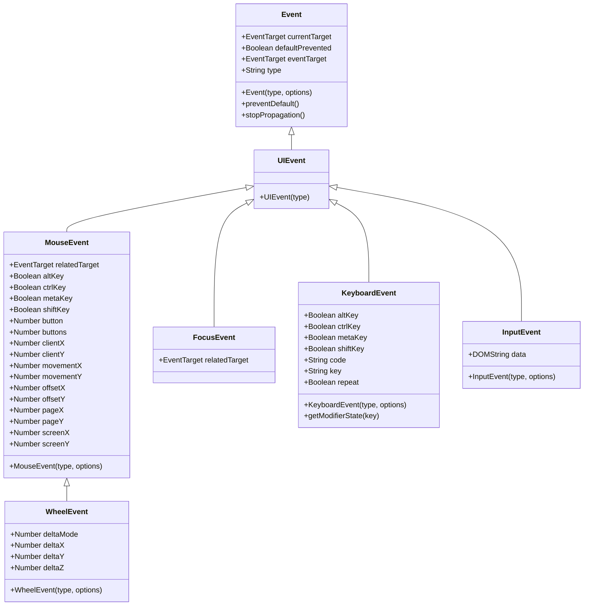
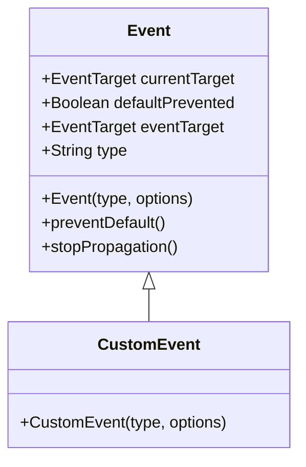

## Part 1

### Type conversions

非 `Object` 型の自動型キャストについて気になるところをチェックしておく。
いざとなれば明示的キャストが有効なので困ることはない。

1. `String` へのキャストは `String` 値が必要なときに暗黙的に行われる。
2. `Number` へのキャストは数学関数や式の中で暗黙的に行われる。
3. `Boolean` へのキャストは論理演算が必要なときに暗黙的に行われる。

明示的キャストの一覧：

1. `String(value)`
2. `Number(value)`, `+value`
3. `Boolean(value)`, `!!value`

### 比較演算子の使い方 `===` など

JavaScript 固有の挙動として、型が異なる値を比較してもエラーにならない。
先述の自動型キャストが発動して型を揃えてから比較される。
両辺ともに `Number` 型にキャストされると憶えておいて間違いない。

そこで演算子 `===`/`!==` がある。これは自動型キャストを一切行わない。
両辺の型が異なっていれば、それだけで `false`/`true` と評価される。

### `??`

既存コードで `result = a ?? b` のような書き方に置き換えることを考えたい。

### モジュールに 'use strict' は不要

書いてあったら sed 的に削ってしまえ。

### JSDoc の導入方法

[jsdoc - npm](https://www.npmjs.com/package/jsdoc) に書いてある。

しかし、これだけだとハローワールドがわからないので、次を試す：
[JSDoc Tutorial](https://learning-zone.github.io/jsdoc-tutorial/)

### Mocha の導入方法

[Mocha - the fun, simple, flexible JavaScript test framework](https://mochajs.org/) に書いてある。

### `Object.assign()` を使う

オブジェクトの複製方法を理解しておく。
対象オブジェクトのプロパティーは指示されなければ保存されるので、実態としてはマージと言いたい。

```javascript
Object.assign(dest, [src1, src2, src3...]);
```

キーと値の集合ではなく、オブジェクトを `src` としてもよい。
その場合には元オブジェクトのプロパティーのキーと値がマージされる。

```javascript
let clone = Object.assign({}, user);
```

`Object.assign()` を使わない方法もある：

```javascript
let clone = {...user};
```

深い複製をするにはより巧妙な手段を講じる必要がある。

### `this` 周り

オブジェクトのメソッドが、そのオブジェクトのメンバーにアクセスすることを考える。
その前にオブジェクト自身にアクセスする必要がある。この状況でキーワード `this` を用いることができる。
`this` の値は、メソッドを呼び出すために使用されるオブジェクトのドット以前が指すものに等しい。

JavaScript に慣れていない段階では、`this` が `undefined` を指す状況によく陥る。
こういうときには `call()`/`apply()`, `bind()` の適用や、
`function` 型関数を矢関数に置き換えることを調べるようにする。

### 演算子 `?.` を使うか

```javascript
user?.address?.street;
document.querySelector('.elem')?.innerHTML;
```

この演算子は short-circuit ルールが適用される。

### さらに `?.()`, `?.[]` も使うか？

オブジェクト `userAdmin` と `userGuest` があり、もしかしたらメソッド
`admin()` があるかもしれない場合に次のようなコードがあり得る：

```javascript
userAdmin.admin?.();
userGuest.admin?.();
```

オブジェクト `user1` と `user2` があり、もしかしたらプロパティー
`firstName` があるかもしれない場合に次のようなコードがあり得る：

```javascript
user1?.["firstName"];
user2?.["firstName"];
```

### `parseInt()`, `parseFloat()`

```javascript
parseInt(string);
parseInt(string, radix);
```

`parseInt()` は第一引数を文字列とする。文字列でない引数には自動型キャストが発生する。

先頭に空白文字が来ても結果に影響しない。

正負の符号は考慮される。

極端な値の `radix` は認められず、`NaN` を返す。

`parseInt()` の戻り値を `isNaN()` でなるべくテストする。

```javascript
parseFloat(string);
```

`Number(string)` との違いは？

### `Object.fromEntries()` をもう一度調べる

このメソッドはキーと値のペアの集合を `Object` に変換するようなものだ。引数は反復可能ならば十分だ。
例えば `Array` や `Map` は通じる。

メソッド `Object.entries()` が逆関数に相当する。これは `Object` をキーと値のペアの配列に変換する。

### `...` 代入

```javascript
[a, b, ...rest] = [10, 20, 30, 40, 50];
```

このような代入ができる。色々とパターンがあって、有用なものを忘れたくない。

### `setTimeout()`, `setInterval()`

Python equivalent を考えると眠れなくなる。

### `call()`, `apply()`

`call()` を少し試す。`null`, `undefined` を与えたときの挙動が MDN の記載どおりであることを確認。

`apply()` は `call()` とほとんど同じ。たとえば演習問題の一問目は次でも同じだ：

```javascript
function spy(func) {
    wrapper.calls = [];

    function wrapper(...args){
        wrapper.calls.push(args);
        return func.call(this, ...args);
    };

    return wrapper;
}
```

二問目では矢関数を採用しない場合には `this` を変なスコープで保存しないとうまく動かない。

```javascript
function delay(f, ms){
    function wrapper(...args){
        let savedThis = this;
        return setTimeout(
            //() => f.call(this, ...args),
            function(){ return f.call(savedThis, ...args); },
            ms);
    }

    return wrapper;
}
```

### `debounce()`

`debounce()` は `clearTimeout()` を無効な ID を与えて呼び出せることが許されているのを利用する。

```javascript
function debounce(f, ms){
  let timeoutId;
  function wrapper(){
    //let savedThis = this;
    //let savedArgs = arguments;
    clearTimeout(timeoutId);
    timeoutId = setTimeout(
      () => f.call(this, ...arguments),
      //function(){ return f.call(savedThis, ...savedArgs); },
      ms);
  }
  return wrapper;
}
```

最後の一回の変更だけ処理すれば十分であるような状況において、このデコレーターが有用だ。
テキストボックスの更新内容をどこかに送る例が挙げられる。他にもあるだろう。

### `throttle()`

`f.call()` と `wrapper.call()` を使い分けるなど、実装が難しいということを憶えておく。
`savedThis` は省略できそうだ？

```javascript
function throttle(f, ms){
    let isThrottled = false;
    let savedArgs;
    function wrapper(){
        if (isThrottled) {
            savedArgs = arguments;
            return;
        }
        isThrottled = true;

        f.call(this, ...arguments);

        setTimeout(() => {
            isThrottled = false;
            if (savedArgs) {
                wrapper.call(this, ...savedArgs);
                savedArgs = null;
            }
        }, ms);
    }
    return wrapper;
}
```

`requestAnimationFrame()` を `throttle()` のように使えるという情報がある。

良資料 [Debouncing and Throttling Explained Through Examples - CSS-Tricks](https://css-tricks.com/debouncing-throttling-explained-examples/)

### `bind()`

引数の順序をうまく扱えないか？ こう書き換えるとどうだろう：

```javascript
function partial(func, ...args) {
    return function(...argsBound) {
        return func.call(this, ...argsBound, ...args);
    }
}
```

### Promise

基本動作を確認する：

```javascript
let p = new Promise((resolve, reject) => {
    reject("POOR");
}).catch(e => alert(e));

let p = new Promise((resolve, reject) => {
    reject("POOR");
}).then(r => alert(r), e => alert(e));

let p = new Promise((resolve, reject) => {
    resolve("OK");
}).catch(e => alert(e));
```

`resolve()` も `reject()` も呼び出さないままでいると、内部状態は pending のまま変わらない。

Python での「等価物」は `asyncio` 周りの機能ということになるのだろう。
`async`/`await` も関係する。

### スクリプトタグの defer や async の理解は問題ないか

ブラウザーが HTML を解析するときに SCRIPT タグを見つけると、DOM の構築をそこで中断する。
そのタグを実行してから構築を再開する。これが DOM 生成の基本だ。

`defer`: そこで中断する代わりにスクリプトのロードをバックグランドで行い、かつ
DOM の構築を続行する。DOM の準備ができたらスクリプトが実行する。
複数の `defer` スクリプトがある場合、それらの順序は考慮される。

`async`: 他のスクリプトのロードを待たないし、他のスクリプトも `async` スクリプトを待たない。
イベント `DOMContentLoaded` さえ `async` スクリプトの完了を待たない。
つまり、ページのロード完了前に実行される。

どちらの属性も、`src` のない（つまり外部ファイルではない）スクリプトには効かない。

以上を踏まえて、モジュールスクリプトは `defer` が与えられていないものでも `defer` が適用される。
HTML ファイルに直接書かれているスクリプトでもだ。
ユーザーはモジュールスクリプトが実行される前のページを一瞬見ることになる可能性が高い。

`async` モジュールの場合はやはり独立性があり、他を待たない。

### `Proxy` で何か面白いことができないか

`Proxy` はふつう `Reflect` と一緒に用いる。

## Part 2

### Walking the DOM で述べられている基本的 API の理解を確認する

DOM ノードを与えると、ナビゲーションプロパティーを使って、そのすぐ近くにあるノードにアクセスできる。
まずはどのノードに対しても有効なプロパティーである次を憶える：

`childNodes`
    直接の子ノード全部。テキストノードなども含む。
`firstChild`
    `childNodes` の先頭要素に等しい。
`lastChild`
    `childNodes` の末尾要素に等しい。
`parentNode`
    親ノード。
`previousSibling`
    親ノードが自身の親ノードに等しく、自身の直前にあるノード。
`nextSibling`
    親ノードが自身の親ノードに等しく、自身の直後にあるノード。

ノードにはテキストも要素もコメントも含まれるので、これらのプロパティーでは邪魔なものを拾ってくることがある。
要素に限定したプロパティーもある：

* `children`
* `firstElementChild`
* `lastElementChild`
* `parentElement`
* `previousElementSibling`
* `nextElementSibling`

### `closest()`

`elem.closest(css)` セレクターに合致する祖先のうち、`elem` から最も近いものを返す。
`elem` 自身が合致するならば、それが返る。

イベントハンドリングにおいて、このメソッドの親へ親へと向かう性質が利用できる。

### Insertion methods 全部確認

何らかの方法で生成したノードを、与えられたノード位置を基準にして挿し込む方法たち。
まず先にメソッド一覧を挙げる。それから引数の意味と振る舞いを述べる。

* `node.append(...nodes or strings)`
* `node.prepend(...nodes or strings)`
* `node.before(...nodes or strings)`
* `node.after(...nodes or strings)`
* `node.replaceWith(...nodes or strings)`

引数 `...nodes or strings` はノードか文字列が複数、カンマ区切りで与えられることを示している。
文字列の場合には、テキストノードとして `node` の近くに挿し込まれる。
ノードでも文字列でもない場合には、JavaScript の規則に従って文字列に自動変換されたものが扱われる。

`node.append()`, `node.prepend()` は引数ノードが子になる。末尾から入れるか先頭から入れるかの違いしかない。

`node.before()`, `node.after()` は引数ノードが兄弟になる。

`node.replaceWith()` は自身を引数ノード全部と取り替える。自身はどこかへ行く。

ノードの生成と挿し込みを同時に行うメソッドもある。

```javascript
elem.insertAdjacentHTML(where, html);
```

引数 `where` は次の文字列のどれか。憶えにくい気がする。しかし、
引数 `html` に `innerHTML` 相当の文字列を指定できる利便性を無視できない。

"beforebegin"
    自身の直前に挿し込む。
"afterbegin"
    自身の子になるように挿し込む。先頭に来る。
"beforeend"
    自身の子になるように挿し込む。末尾に来る。
"afterend"
    自身の直後に挿し込む。

### `elem.classList`

HTML 要素は CSS クラスを一般的には複数含むことに注意。

`elem.className` に CSS 内容を代入すると、クラスを定義する文字列全体が置き換わる。
しかし、たいていの場合にはクラス一つを追加なり削除なりしたい。
この用途にプロパティー `elem.classList` を利用できる。
`elem.classList` はクラス単位で操作するためのメソッドがある特別なオブジェクトだ。

`elem.classList.add("class")`
`elem.classList.remove("class")`
    クラス "class" を追加、削除する。
    削除の場合、指定したクラスがない場合には単に無視されるようだ。
`elem.classList.toggle("class")`
    クラス "class" を既に含む場合には削除を、ない場合には追加をする。
    戻り値の真偽値で実際にはどう処理されたかを区別できる。
`elem.classList.contains("class")`
    クラス "class" を含んでいるかどうかを判定する。

### `window.getComputedStyle(elem)` を上手く使えないか

このメソッドは read-only な値を参照するだけなので、上手く使うということは考えないでいい。

`getComputedStyle(elem)` の用途は具体的なスタイル定義を参照することだ。
例えば、空のドキュメント上で次の二つの値を比較するといい：

```javascript
getComputedStyle(document.body).background;
document.body.style.background;
```

`getComputedStyle()` の戻り値オブジェクトに対して `getPropertyValue()` を呼び出すのがていねいだ。

```javascript
getComputedStyle(document.body).getPropertyValue('background-color');
```

### CSS positioning 各種

一瞬だけ JavaScript というより CSS の理解に集中する。
CSS プロパティー `position` に固有の値指定をまずは理解しておく。

```text
position: static | relative | absolute | fixed | sticky;
```

`static`
    この値のいちばんの特徴は、プロパティー `position` の既定値だということだ。
    `top`, `right`, `bottom`, `left`, `z-index` が意味をなさない。
`relative`
    `static` と比べるとわかりやすい。
    `top`, `right`, `bottom`, `left` の値に基づいて自分自身からの相対オフセットで配置される。
    `z-index` も考慮されるようになる。
`absolute`
    配置基準が、直近の配置されている祖先要素、または初期の包含ブロックとなる。
    それから最終的な位置が `top`, `right`, `bottom`, `left` の値により決定する。
    `z-index` も考慮される。
`fixed`
    `absolute` と似ている。配置基準がもっと外側の祖先になる。ビューポートやページだと考えられる。
`sticky`
    直近のスクロールする祖先および包含ブロックに対して `top`, `right`, `bottom`, `left`
    の値に基づいて相対配置される。

[position - CSS: Cascading Style Sheets | MDN](https://developer.mozilla.org/en-US/docs/Web/CSS/position)
のコードを変更して感覚をつかむといい。

### `element.addEventListener()` のオプション

```javascript
element.addEventListener(event, handler, [options]);
```

`once`
    `true` であれば `handler` は処理後に自動的に削除する。テストなどに使えそうだ。
`capture`
    `true` であればイベントハンドラーは capturing 局面で、
    `false` ならば bubbling 局面でそれぞれ処理される。
    これが重要になるのは、親子関係（一般的には祖先子孫関係）にある要素の同じイベントに対してイベントハンドラーを追加するときだ。
`passive`
    `true` であれば `handler` で `preventDefault()` を呼び出さない（ことをブラウザーに教えて、全体の処理効率を上げる？）。

----

まずイベントの capturing と bubbling の概念を頭に叩き込むことだ。これは憶えないといけない。
[Javascript - Event order](https://www.quirksmode.org/js/events_order.html#link4) の説明が詳しい。

### `elem.dispatchEvent(event)`

UI イベントを JavaScript コードの形で再現するにはこのメソッドが利用できるはずだ。
そのためにイベントオブジェクトを自前で生成する必要がある。
まず、イベントクラスのコンストラクターを理解する。



いずれも `options` の `bubbles` フラグは明示的に指定するほうがいい。

サブクラス固有のプロパティーをセットするのにコンストラクターで `options` の対応プロパティーを指定する感じか。
そうなると `MouseEvent` の生成で一部のタイプでは著しく難しい。

首尾よくイベントオブジェクトを用意できたら `dispatchEvent()` を呼び出す。

### `CustomEvent`

クラス `CustomEvent` を研究したい理由は、WebGL コードでビュー操作をイベントにしたいから。



まず `CustomEvent()` に入力する文字列 `type` の値を標準にはない値にする。
さらに `options` にはプロパティー `detail` を必ず持たせ、その値を
`Object` とする。

## Part 3

### `requestAnimationFrame()`
