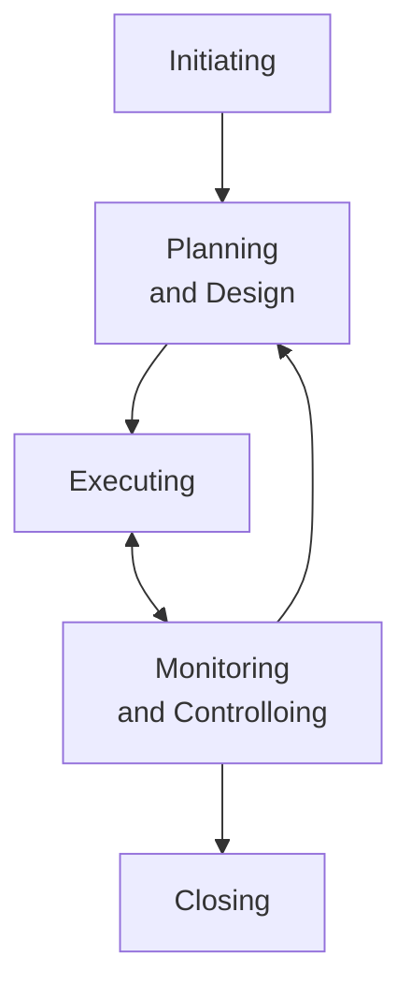

## 10 Best Project Management Books for the Project Professional

<https://project-management.com/top-10-best-project-management-books-to-keep-within-reach/>

1. A Guide to the Project Management Body of Knowledge
2. Project Management Absolute Beginner's Guide
3. The Fast Forward MBA in Project Management
4. Project Management: A Systems Approach to Planning, Scheduling, and Controlling
5. Guide to Project Management: Getting it right and achieving lasting benefit
6. Brilliant Project Management: What the best project managers know, do, and say
7. Project Management Lite: Just Enough to Get the Job Done...Nothing More
8. Project Management JumpStart
9. Strategic Project Management Made Simple – Practical Tools for Leaders and Teams
10. Making Things Happen: Mastering Project Management

PMBOK というアクロニムで通じるくらい著名な本らしい。

Project Management Absolute Beginner's Guide は入手しやすそう。

Project Management: A Systems Approach to Planning, Scheduling, and Controlling は改訂版が多い。

## Project management - Wikipedia

<https://en.wikipedia.org/wiki/Project_management>

### History

1900 年までは土木プロジェクトは、クリエイティブな建築家、技師、親方が自ら manage するのが一般的だった。

* Vitrvius (BC 1): ローマの建築家。
* Christopher Wren (1632-1723): 歴史上最も高く評価された英国人建築家。解剖学者、天文学者、幾何学者、数学者、物理学者でもある。
* Thomas Telford (1757-1834): スコットランドの土木技師。
* Isambard Kingdom Brunel (1806-1859): 工学の巨人と称される。

1950 年代、組織は複雑なエンジニアリングプロジェクトにプロジェクトマネジメントのツールやテクニックを体系的に適用し始めた。

* Henry Gantt (1861–1919): 計画管理法の父と称される。Gantt チャートで著名。
* Henry Fayol (1841-1925): プロジェクトおよびプログラムマネジメントに関連する
  知識体系の基礎を形成する五つのマネジメント機能を考案。

この二人には共通の師 Frederick Winslow Taylor (1856-1915) がいた（年齢が近いが）。
彼の科学的管理理論は、作業分解構造 (WBS) や資源配分など、現代のプロジェクト管理ツールの先駆けとなっている。

1950 年代は、エンジニアリングの中核的な分野が集まって一つの仕事をする、
現代のプロジェクトマネジメントの時代の始まりであった。
プロジェクトマネジメントが工学的モデルを持つ経営学から発生する独立した学問として認識されるようになった。

当時、2つの数理的なプロジェクトスケジューリングモデルが開発された。
これらの手法は、すぐに多くの民間企業に広まった。

* CPM (Critical Path Method): DuPont 社と Remington Rand 社の共同事業として、
  工場の保全プロジェクトを管理するために開発された。
* PERT (Program Evaluation and Review Technique): アメリカ海軍特殊プロジェクト室が、
  Lockheed 社、Booz Allen Hamilton 社と共同で開発した、ポラリスミサイル潜水艦
  計画の一環として開発された。

プロジェクト・コスト見積もり、コスト管理、工学的経済学の技術も、Hans Lang らによる
先駆的な研究によって発展していた。
1956 年、プロジェクトマネジメントとそれに関連する計画・スケジュール、コスト見積もり、
コスト・スケジュール管理（プロジェクト管理）の専門分野の初期の実務家によって、
米国コストエンジニア協会 ACCE が設立された。

AACEは先駆的な活動を続け、2006 年にポートフォリオ、プログラム、プロジェクト管理のための最初の統合プロセス
（トータルコスト管理フレームワーク）を発表しました。

1969 年、アメリカでプロジェクトマネジメント協会 (PMI) が設立された。
PMI は 1996 年に William Duncan を主著者とする *A Guide to the Project Management Body of Knowledge*
(PMBOK Guide) の原版を発行し、ほとんどのプロジェクト、ほとんどの時間に共通するマネジメントの実践を述べている。

### Project management types

プロジェクトマネジメントの手法は、あらゆるプロジェクトに適用することができる。
プロジェクトの規模や性質、業界によって、特定の型のプロジェクトに合わせられることが多い。
例えば、IT プロジェクトマネジメントは、計画、設計、開発、テスト、導入といった様々なライフサイクル段階を経て、
技術資産やサービスを提供することに特化したプロジェクトマネジメントであり、
IT プロジェクトマネジメントと呼ばれる。

また、プロジェクトマネジメントには、ハード（物理）型とソフト（非物理）型という分類もある。

プロジェクトマネジメントに共通するのは、時間、品質、コストという三つの重要な目標に焦点を当てることだ。
成功するプロジェクトとは、スケジュール通りに、予算内で、事前に合意した品質基準に従って完成させることであり、
プロジェクトの成否を決める「鉄の三角形」「三重の制約」を満たす。

プロジェクトマネージャーは、プロジェクトマネジメントの種類ごとに、
その業界に特化した再現性のあるテンプレートを開発し、活用する。
これにより、品質向上、納期短縮、コスト削減を目的としたプロジェクト計画が徹底され、
高い再現性を持つようになった。

### Approaches of project management

2017 年のある研究では、あらゆるプロジェクトの成功は、四つの重要な側面がプロジェクトに影響を与える
X とどれだけ整合しているかに依存すると示唆した。

* Plan: 計画・予測活動
* Process: すべての活動に対する全体的な取り組み方と計画過程
* People: 協力と通信がどのようであるかの動態を含む
* Power: 権限、意思決定者、組織図？、実施方針など

プロジェクト活動を組織し完了させるためのアプローチには、段階的、無駄のない、反復的、
漸進的なものなど、いくつもの方法がある。また、プロジェクト計画には、成果物ベース、
活動ベースなど、いくつかの拡張方法がある。

どのような方法を採用するにしても、プロジェクト全体の目的、スケジュール、コスト、
およびすべての参加者と利害関係者の役割と責任について慎重に検討する必要がある。

#### Benefits realization management

BRM は、製品やアウトプットではなく、プロジェクトの成果に焦点を当て、それがどの程
度実現されているかを測定し、プロジェクトを軌道に乗せることによって、通常のプロ
ジェクトマネジメント手法を強化するものだ。これにより、合意された要件、すなわちプ
ロジェクトの成功を実現しながらも、その要件から得られる利益、すなわち製品の成功を
実現できず、完成したプロジェクトが失敗に終わるリスクを低減することができる。

さらに、BRM の実践は、プロジェクトの成果と業務戦略の戦略的な整合性を確保する
ことを目的としている。 BRM の実践が、国や業界を問わず、戦略的な観点からプロジェ
クトの成功に影響を与えることを証明する最近の研究により、これらの実践の有効性が裏
付けられている。このような幅広い効果は、戦略的影響と呼ばれている。

例えば、従業員のデータを処理し、給与、休日、従業員の人事記録を短時間で管理し、エ
ラーを減らすコンピュータシステムを実現することに合意することが、プロジェクトを要
求事項に適合させる例として挙げられる。BRM では、システム導入後、導入前と比較して、
スタッフデータの処理や維持に必要なスタッフの時間やエラーを一定量削減することを合
意する場合がある。

#### Critical path method

クリティカルパス法とは、プロジェクト活動のスケジュールを決定するためのアルゴリズムだ。
予測に基づくプロジェクト計画に用いられる伝統的なプロセスだ。

CPM 法では、活動の順序、必要な作業工数、相互依存関係、その結果得られる line sequence ごとの余裕時間を評価し、
必要なプロジェクト期間を決定する。したがって、定義上、クリティカルパスは、
ネットワーク図上のタスクの経路のうち、余分な時間がないか非常に少ない経路となる。

#### Critical chain project management

クリティカルチェーンプロジェクトマネジメントは、制約条件理論をプロジェクトの計画・管理に応用したものだ。
プロジェクト管理に内在する不確実性に対処し、プロジェクト遂行に必要な資源
（物理的、人的スキル、管理・対応能力）の限られた利用可能性を考慮するために設計されている。

目標は、組織内のプロジェクトの流れ（スループット）を増大させることだ。
制約条件理論の五つの焦点化段階のうち最初の三つを適用し、
プロジェクトすべてのシステム制約と資源を特定する。この制約を克服するために、
クリティカルチェーン上のタスクは他のすべての活動より優先される。
最終的に、クリティカルチェーンのタスクが開始されなければならないときに、
資源が準備できていることを確認するために、プロジェクトを計画・管理し、
他の資源すべてをクリティカルチェーン下に置く。

#### Earned value management

EVM は、プロジェクトマネジメントを拡張し、プロジェクトの監視を改善する技術だ。
作業と価値（費用）の観点から、完成に向けたプロジェクトの進捗を見せる。
Earned Schedule とは EVM の理論と実践を拡張したものだ。

<!-- この項目は特に Wikipedia の個別エントリーをチェックすること -->

#### Iterative and incremental project management

プロジェクトマネジメントの批判的な研究では次のような指摘がされている：
段階的取り組み方では、大規模かつ複数の企業が参加するプロジェクト、未定義の要件、
あいまいな要件、変化の速い要件、高度のリスク、依存性、変化の速い技術を持つ
プロジェクトにはあまり適していない。
プロジェクトの初期段階で行われる計画は高度の不確実性に苦しんでいるので、
the cone of uncertainty はこの一部を説明している。
これは、ソフトウェア開発がしばしば新製品またはその実現であることから、特に顕著になる。

このような複雑性は、より探索的な、あるいは反復的で漸進的な取り組み方で扱う方が良
い。反復的で漸進的なプロジェクト管理のモデルがいくつか発展してきた：

* アジャイルプロジェクト管理
* 動的システム開発法
* 極限プロジェクト管理
* Innovation Engineering®

#### Lean project management

リーンプロジェクトマネジメントは、リーン生産方式の原則を用い、より少ない (lean) 無駄
とより短い時間で価値を提供することに重点を置く。

#### Project lifecycle

プロジェクトのライフサイクルには五つの段階があり、過程グループと呼ばれている。
グループそれぞれが相互に関連する一連の過程を表し、完了すべき一連の明確な段階を通じて作業を管理する。
このようなプロジェクト手法は、しばしば伝統的であるとか、ウォーターフォールであると言われる。

1. 開始 (Initiating)
2. 計画 (Planning)
3. 実行 (Executing)
4. 監視と制御 (Monitoring and Controlling)
5. 終了 (Closing)

業界によっては、これらの段階の変種を使用し、組織により適した名称に変更する場合もある。
例えば、実店舗の設計・建設に携わる場合、プロジェクトは通常、事前計画、概念設計、
概略設計、設計開発、施工図、施工管理といった段階を進行する。

段階的取り組みでは、小規模で明確なプロジェクトには有効だが、大規模なプロジェクト
や、より複雑であいまいな問題や潜在的な危険を抱えるプロジェクトでは、しばしば困難や失敗を
招くことになる。

#### Process-based management

プロセスベースマネジメントの導入は、OPM3 や CMMI (Capability Maturity Model
Integration) などの成熟度モデルの活用により推進されてきた。

#### Project production management

プロジェクト生産経営とは、資本プロジェクトの完遂に操作経営を応用することだ。
プロジェクト生産管理の体制は、プロジェクトが入力（原材料、情報、労働力、
工場、機械）を出力（商品・サービス）に変換するという、生産体系としての
プロジェクト観に基づいている。

#### Product-based planning

生産物ベースの計画は、プロジェクトマネジメントの構造化された取り組み方であり、
プロジェクト目標の達成に貢献するすべての生産物（プロジェクト成果物）を特定する
ことに基づく。この取り組み方の最も一般的な実装は PRINCE2 だ。

### Process groups

伝統的に、プロジェクトマネジメントは、四つから五つのプロジェクトマネジメント
プロセスグループと、コントロールシステムといういくつかの要素からなる。
どのような方法論や用語が使われていても、プロジェクトマネジメントの基本的な
プロセスや開発段階は同じだ。主なプロセス群は、一般的に次からなる：

* Initiation
* Planning
* Production or execution
* Monitoring and controlling
* Closing

探索的要素の強いプロジェクト環境（研究開発など）では、これらの段階に加え、
プロジェクトの継続を議論し決定する段階を設けることもある。例として、phase-gate
モデルがある。

<!-- 例のモデルはウォーターフォールと同じ -->

#### Initiating

開始過程は、プロジェクトの性質と範囲を決定する。この段階がうまくいかないと、プロ
ジェクトが業務の要求を満たすことに成功しなくなりがちだ。ここで必要なプロジェクト
統制は、業務環境を理解し、必要なコントロールがすべてプロジェクトに組み込まれてい
ることを確認することである。不備があれば報告し、修正するよう勧告する必要がある。

開始段階では、以下の領域を網羅した計画を立てる。これらの領域をプロジェクト開始文書
と呼ばれる一連の文書に記録することができる。文書はプロジェクト期間中の秩序を作るために
使われる。これらは、以下のようなものからなる傾向がある：

* プロジェクト提議：プロジェクトの背景、全体目標、期間。
* プロジェクト範囲：プロジェクトの方向性、軌道。
* product breakdown structure (PBS): 成果物・結末の階層とその構成要素。
* work breakdown structure (WBS): 日々の業務に至るまで、やるべきことの階層化。
* 責任分担表 (RACI - Responsible, Accountable, Consulted, Informed):
  成果物・結末に沿った役割と責任
* 暫定プロジェクト日程：マイルストーン、重要な日付、締切日。
* 測定可能な目標に対する業務要求の分析
* 現行事業の見直し
* 費用と利益の財務分析。予算を含む。
* 利害関係者分析：プロジェクトの利用者やサポート担当者がある。
* プロジェクト憲章：費用、課題、成果物、日程がある。
* SWOT 分析：事業の強み、弱み、機会、脅威の分析。

#### Planning

開始段階の後、プロジェクトは適切な詳細レベルまで計画される。
主な目的は、時間、費用、資源を適切に計画し、必要な作業を見積もり、プロジェクト
実行中のリスクを効果的に管理することである。
開始段階グループと同様に、適切な計画を立てることができなければ、プロジェクトが
目標を成功裏に達成する可能性は著しく下がる。

計画は、一般的に次で構成される：

* プロジェクト管理手法決定（画を完全に先行的に定義するのか、反復的に定義するのか、
  rolling waves で定義するのか等）。
* 範囲陳述書作成
* 計画班選出
* 成果物特定、PBS および WBS 作成
* 成果物を完成させるために必要な活動を特定し、その活動を論理的な順序でネットワーク化する。
* 活動に必要な資源の見積もり
* 活動の時間や費用の見積もり
* 日程策定
* 予算策定
* リスク計画
* 品質保証施策策定
* 作業開始の正式な承認を得る

また、情報交換や範囲管理の計画、役割と責任の明確化、プロジェクトで購入
するものの決定、初会合の開催などの追加的諸段階も一般的に推奨される。

新製品開発プロジェクトでは、最終製品の動作の概念設計をプロジェクトの計画活動と同
時に行うことがあり、成果物や計画活動を特定する際に計画チームに情報を提供するのに
役立つ場合がある。

#### Executing

実行している間中、実行の必要がある予定期限が何であるかを知らなければならない。
実行・実施局面では、プロジェクトマネジメント計画の成果物がそれに従って実行されることを確認する。
この局面では、人材、資材、予算などの資源を適切に配分、調整、管理する。
この局面の出力は、プロジェクトの成果物だ。

#### Project documentation

プロジェクトを成功させるには、プロジェクト内のあらゆるものを文書化することが重要
だ。予算、範囲、効果、歩調を維持するために、プロジェクトは各課題に関連する物理的
な文書を持たなければならない。正しい文書があれば、プロジェクトの要求が満たされて
いるかどうかを簡単に確認することができる。また、文書を管理することで、そのプロ
ジェクトで何がすでに完了したかという情報も得られる。プロジェクト全体の文書は、過
去にさかのぼって作業を参照する必要がある人に対して紙による痕跡を与える。ほとんど
の場合、文書管理は、プロジェクトの特定の局面を監視し、管理する最も成功した方法
だ。正しい文書化によって、プロジェクトが進むにつれてプロジェクトの成功が追跡さ
れ、観察されるようになる。正しく実行されれば、文書管理はプロジェクトの成功の基幹
となる。

#### Monitoring and controlling

監視と統制は、プロジェクトの実行を観察するために行われる過程で、潜在的な問題を適
時に特定し、必要に応じて是正措置をとってプロジェクトの実行を制御することができる
ようにする。主な利点は、プロジェクトの具合を定期的に観察・測定し、プロジェクト管
理計画との差異を特定することだ。

監視と統制には次が含まれる：

* 進行中のプロジェクト活動を測定すること
* プロジェクトの変数（費用、労力、範囲など）をプロジェクト管理計画やプロジェクト
  具合の基準値に対して監視すること
* 問題やリスクに適切に対処するための是正措置を特定すること、
* 統合変更管理を回避し得る要因に影響を与え、承認済みの変更しか実施されないように
  すること

プロジェクトにおける監視と統制を支える主な仕組み二つある。一つ目の契約は、一連の
規則と報酬を提供する。罰則や制裁によってしばしば支えられる。二つ目の業務とマネジ
メントの学者は、プロジェクトの目的を達成するための統合人（プロジェクト男爵とも呼
ばれる）の役割に注目している。一方、プロジェクトマネジメントの最近の研究では、契
約と統合人の相互関係の型に疑問を呈している。また、このような監視の仕組みは、ある
種の組織が他の組織を利用する利点を減少させるため、代替物として機能していると主張
する者もいる。

多局面プロジェクトでは、監視と統制のプロセスは、プロジェクト局面間の反響も提供
し、プロジェクトをプロジェクトマネジメントプランに適合させるための是正措置や予防
措置を実施する。

プロジェクト維持は継続的な過程であり、以下のものを含む：

* エンドユーザーへの継続的なサポート
* エラーの修正
* 時間の経過に伴う製品の更新

この段階では、監査人はユーザーの問題がいかに効果的かつ迅速に解決されるかに注目す
る必要がある。

建設プロジェクトの途中で、作業範囲が変更されることがある。変更は、建設過程におい
て普通であり予期される部分だ。変更は、必要な設計の修正、現場条件の違い、
材料の入手可能性、請負業者の要求する変更、価値工学、第三者からの
影響など、さまざまな要因によって生じる。現場で変更を実行するだけでなく、通常、
実際に何が施工されたかを示すために、変更を文書化する必要があるのが普通だ。
これは変更管理と呼ばれる。したがって、所有者は通常、すべての変更、より具体的には、
完成した仕事の有形部分を修正する変更のすべてを示す最終記録を要求する。この記録
は、契約文書、通常は、設計図面に作成されるが、必ずしもこれに限定されるものではな
い。このような努力の末に出来上がったものが、業界用語で竣工図 (as-built) だ。
建設工事契約では、この図面の提出が義務付けられる。
建設文書管理は、オンラインまたはデスクトップのソフトウェアシステムを使用して、
あるいは物理的な文書によって維持される非常に重要な作業だ。建設業が正しい文書を
維持するための正当性が高まっているため、文書管理システムの需要が高まっているのだ。

プロジェクトに変更が生じた場合、プロジェクトの実行可能性を再評価する必要がある。
プロジェクトの当初の目標やゴールを見失わないようにすることが重要だ。変更が積み重
なると、予測された結果が、当初提案したプロジェクトへの投資を正当化できなくなるこ
とがある。プロジェクトマネジメントを成功させるには、これらの要素を特定し、進捗状
況を追跡、監視し、プロジェクト開始時に説明した時間と予算の枠内に収まるようにす
る。プロジェクトのライフサイクルに沿って、その進捗と予想期間に関する最も有益な監
視点を特定するための正確な方法が提案されている。

#### Closing

終結は、プロジェクトの正式な受諾と終了を含む。管理活動は、ファイルのアーカイブ化、
教訓の文書化などを含む。

この局面の構成：

* 契約の終結：各契約の完了と決着（未決事項の解決を含む）、プロジェクトまたはプロジェクト局面に適用される各契約を締結する。
* プロジェクト終結：プロジェクトまたはプロジェクト局面を正式に終了させるために、すべての過程グループにわたる活動すべてを終了させる。

また、この局面には実施後の見直しも含まれます。プロジェクトチームが経験から学び、
今後のプロジェクトに活かすために重要な局面だ。通常、実施後の見直しでは、プロジェ
クトでうまくいったこと、失敗したことを分析し、教訓を導き出す。

#### Project control and project control systems

プロジェクト統制（費用工学とも呼ばれる）は、プロジェクトマネジメントの独立した機
能として確立されるべきものだ。定義された業績と正式な目標を強化するため
に、プロジェクトの処理中に検証および統制機能を実現する。プロジェクト統制の課題は
次のものでもある：

* 正しい情報の供給とその更新のための基本システムの生成
* プロジェクト変数の格差の伝達方法の確立
* 組織内ネットワークに基づくプロジェクト情報技術の開発、またはプロジェクトの重要業績評価指標システム (KPI) の決定
* 相違分析および潜在的なプロジェクト規制のための提案の作成
* 適切なプロジェクト構造、プロジェクトワークフロー組織、プロジェクト統制、統治を実現するための手法の確立
* プロジェクト変数の透明性の生成

これらの仕事の遂行と実現は、プロジェクト統制固有の方法と手段を適用することによっ
て達成される。プロジェクト統制の方法としては、以下のようなものがある：

* 投資分析
* 費用便益分析
* 価値便益分析
* 専門家調査
* 模擬計算
* リスクプロファイル分析
* 不足額計算
* マイルストーン傾向分析
* 費用傾向分析
* 目標実績比較

プロジェクト統制とは要素であって、プロジェクトを計画通りに、時間通りに、予算内で
進めるものだ。プロジェクト統制は、プロジェクトの早期には計画から始まり、プロジェ
クトの末期には実施後の見直しで終わり、過程の各段階に徹底的に関与することだ。プロ
ジェクトは、プロジェクトの進行中に監査や再審を受けることがある。正式な監査は、一
般にリスク基準または受諾基準であり、経営者が監査の目的を指示する。審査には、承認
されたプロジェクト管理過程と、実際にプロジェクトがどのように管理されているかを比
較することも含まれる。各プロジェクトは、必要なコントロールの適切な水準について評
価されるべきだ。統制が強過ぎると時間がかかり過ぎ、弱過ぎるとひじょうに危険だ。プ
ロジェクト管理が正しく行われていない場合は、過失や修正の観点から、業務に対する
費用を明確にする必要がある。

統制系統は、費用、リスク、品質、情報交換、時間、変更、調達、人事などに必要だ。さ
らに、監査人は、プロジェクトが財務諸表にとってどれだけ重要か、利害関係者がどれだ
け統制に依拠しているか、どれだけの統制が存在するかを考慮する必要がある。監査人
は、開発過程やその実施方法に関する手順を審査する必要がある。また、必要または要求
に応じて、開発過程や最終製品の品質も評価することがある。企業は、問題を早期に発見
し、より容易に修正できるように、監査法人が過程全体に関与することを望むかもしれな
い。監査人は、開発チームの一員として統制請負人として、または監査の一環として独立
した監査人として、その役割を果たすことができる。

企業では、形式的システム開発過程を採用することがある。これは、システムが正常に開
発されることを保証するのに役立つ。形式的過程は強固な統制を構築するためにはより効
果的であり、監査人は、この過程が適切に設計され、実際に追従されていることを確認す
るために、この過程を審査するべきだ。良い形式的システム開発計画の概要は次のとおり
だ：

* 組織の幅広い目標に開発を整合させる戦略
* 新しいシステムに対する標準
* 時期と予算に関するプロジェクト管理方針
* 過程を記述する手順
* 変化の質の評価

### Characteristics of projects

プロジェクトには、重要な特徴が五つある：

1. 具体的な開始日と終了日が必ずある。
2. 人々の集団が実行して完成する。
3. 出力は一意的な製品またはサービスの提供だ。
4. 一時的なものだ。
5. 漸進的に精緻化される。

例：新しい車を設計する、本を書く、など。

#### Project complexity

複雑性とその性質は、プロジェクトマネジメントの領域で重要な役割を果たす。この主題
について多くの議論があるにもかかわらず、研究では、複雑なプロジェクトの管理に関連し
て、複雑さの定義と合理的な理解の欠落を示唆している。

プロジェクトの複雑性とは特性であって、プロジェクト系統に関する合理的に完全な情報が与えら
れたとしても、その全体的な挙動を理解し、予見し、制御下におくことを難しくするというものだ。

複雑なプロジェクトの識別は、マルチプロジェクト工学環境にとって特に重要だ。

プロジェクトの複雑さと性能は密接に関係していると考えられているため、プロジェクト
マネジメントを効果的に行うためには、プロジェクトの複雑さを定義し、測定することが
重要だ。

複雑性には、以下のようなものがある：

* 構造的複雑性。すなわち多くの多様な相互関連する部分から構成される。
  一般的に、プロジェクト構成要素のサイズ、多様性、相互依存の観点から表され、
  技術的および組織的要因によって説明される。
* 動的複雑性は、あいまいさ、不確実性、伝播、出現、混沌などの現象、特性、顕現のことを指す。

Cynef階層 の骨格に基づけば、複雑なプロジェクトを次のように分類することができる：

* Simple: 単純な（または明確な、明白な、既知の）プロジェクト、システム、またはコンテキスト。
  既知なる既知、安定性、明確な因果関係によって特徴付けられる。
  標準的な作業手順や最善実践で解決することができる。
* Complicated: 複雑。既知なる未知によって特徴付けられる。複雑なシステムは部分の和だ。
  原理的には、より小さな単純な構成要素に分解することができる。困難ではあるが、
  複雑な問題は追加的な資源、専門知識、分析的、還元的、単純化、分解技術、
  シナリオ計画、優れた実践に従えば、理論的に解決可能だ。
* Complex: 複雑の特徴は、未知なる未知、そして創発性だ。パターンは解明されうる
  が、自明ではない。複雑なシステムは Euclid の「全体は部分の総和以上である」とい
  う言葉によって記述することができる。
* Really complex: 本当に複雑なプロジェクト。別名、非常に複雑なプロジェクト、または無秩序プロジェクト。
  未知なものが多いのが特徴。本当に複雑なプロジェクトではパターンが見分けられない。
  因果関係は振り返っても不明だ。Aristotle の言葉を借りれば、本当に複雑なシステムは、
  その部分の総和とは異なるものである。

*Requisite Organization* と *Stratified Systems Theory* で述べられている仕事の複
雑さを測る発見を応用して、Elliott Jaques 博士はプロジェクトとプロジェクト作業
（段階、課題）を、裁量の期間やプロジェクトの出力の複雑さなどの目安に基づいて、プ
ロジェクトの複雑さを七段階の基本水準に分類している：

| Project Level | Description |
|---------------|-------------|
| 1 | 業務過程における活動の直接的出力（量、質、時間）改善を三ヶ月以内の完了目標で行う。 |
| 2 | 業務過程への適合性を開発、改善を三ヶ月から一年の完了目標で行う。 |
| 3 | 業務過程の開発、変更、改善を一、二年の完了目標で行う。 |
| 4 | 機能系統の開発、変更、改良を、二年から五年の完了目標で行う。 |
| 5 | 機能系統、業務機能群の開発、変更、改善を五年から十年の完了目標で行う。 |
| 6 | 一企業の単一の価値連鎖全体を開発、変更、改善を十年から二十年の完了目標で行う。 |
| 7 | 一企業の複数の価値連鎖を開発、変更、改善を二十年から五十年の完了目標で行う。 |

プロジェクトの複雑性を測定することで得られる利益は、プロジェクト関係者の実現可能性を次で向上させることだ：

* プロジェクトの複雑性の水準とプロジェクトの有効完了目標時間を釣り合わせる
* プロジェクトの複雑性の水準とプロジェクトマネージャーの能力水準を釣り合わせる
* プロジェクトの課題の複雑さの水準と、プロジェクト構成員のそれぞれの能力を釣り合わせる

#### Positive, appropriate (requisite), and negative complexity

必要な多様性の法則と必要な複雑性の法則と同様に、プロジェクトの複雑性は、プロジェ
クトが目的を達成するために必要な場合もあるし、有益な結果をもたらす場合もある。
Stefan Morcov は、複雑性の効果に基づいて、それを Positive, Appropriate, Negative
に分類することを提案した。

* 正の複雑性とは複雑性であって、プロジェクトに付加価値を与え、プロジェクトの成功に寄与し、関連する負の影響を上回るものだ。
* 適切な（または必要な）複雑性とは複雑性であって、プロジェクトが目的を達成するために必要な複雑
  さ、またはプロジェクトの成功への貢献が負の影響と釣り合うか、または緩和の費用が負の症状を上回るものだ。
* 負の複雑性とは複雑性であって、プロジェクトの成功を妨げるものだ。

### Project managers

プロジェクトマネージャーとは、プロジェクトマネジメントの分野の専門家だ。プロジェ
クトに参加する人々を管理する立場にある。プロジェクト成功の鍵は人だ。適切な人が適
切な場所に適切な時間でいなければ、プロジェクトは成功しない。プロジェクトマネー
ジャーは、建設業界、土木工事、建築、計算機、情報通信に関連するあらゆるプロジェク
トの計画、実行、管理、終了を担当することができる。その他、生産技術、設計技術、重
工業など、多くの分野でプロジェクトマネージャーが活躍している。

プロジェクトマネージャーは、プロジェクトの実行順序を理解し、プロジェクトの日程を
正しく組むと同時に、プロジェクト内の個々の課題の達成に必要な時間を把握する必要が
ある。プロジェクトマネージャーは、顧客に代わってプロジェクトの目標を達成するため
の責任者だ。プロジェクトマネージャーは、その分野で何年も経験を積んでいることが多
い。プロジェクトマネージャーは、プロジェクトに携わる作業員を監督しながら、プロ
ジェクトを熟知することが要求される。典型的には、建設、土木工事、建築、工業プロ
ジェクトでは、プロジェクトマネージャーは、日常的に課題の実行を担当する別のマネー
ジャーと一緒に働いている。この役職は、場合によっては監督 (superintendent) と呼ば
れることもある。監督とプロジェクトマネージャーは、手を取り合って日々の課題をこな
していく。プロジェクトマネジメントの主な仕事は、明確で達成可能なプロジェクト目標
の作成、プロジェクト要件の構築、プロジェクトの三制約（現在はさらに制約を含めて競
合制約と呼んでいる）の管理だ。最初の三つは費用、時間、品質、範囲だが、現在のプロ
ジェクトマネジメントではさらに三つ程度が追加されている。典型的プロジェクトは、プ
ロジェクトマネージャーの下で、時間と予算の目標値内に課題を完了させるために働く作
業者の班によって構成されている。プロジェクトマネージャーは通常、プロジェクトの完
了と成功について、より高い地位の人物に直接報告する。

プロジェクトマネージャーは、多くの場合依頼人の代理であり、代理人である会社の知識
に基づいて、依頼人の需要を正確に判断し、実行しなければならない。費用、時間、品
質、そして何よりも依頼人の満足という重要な課題を確実に実現するためには、契約先の
さまざまな社内手続きに適応し、指名された代表者と密接な関係を築く能力が不可欠だ。

完全なプロジェクトマネージャーとは、Robert J. Graham 博士が彼の模擬の中で初めて
使った用語であって、 Randall L. Englund と Alfonso Bucero は、指導者、影響力、交
渉、政治、変更・衝突管理、気心など複数の分野を包含する人であると述べている。これ
らはすべて、プロジェクトリーダーがより効果的に、最適化された一貫した結果を達成す
るための「柔らかい」社交術なのだ。

### Multilevel success framework and criteria - project success vs. project performance

プロジェクトの成功とプロジェクトマネジメントのそれは混同される傾向がある。この二つは別物だ。
「プロジェクトの成功」には観点が二つある：

* 過程の観点。すなわち効率的な出力を達成すること。一般にプロジェクトマネジメント能率またはプロジェクト効率と呼ばれる。
* 結果の観点。すなわち有益な結果を達成すること。一般にプロジェクト能率と呼ばれる（単にプロジェクトの成功とも）。

プロジェクトマネジメントの成功目安は、プロジェクトのそれとは異なる。プロジェクト
マネジメントは、与えられたプロジェクトが、合意された時間内に、合意された範囲内
で、合意された予算内で完了すれば成功であると言われている。プロジェクトを成功させ
るために、三重制約に続いて多重制約というものが考えられるようになった。しかし、三
重制約にせよ多重制約にせよ、あくまでもプロジェクトの効率性を示すものであり、プロ
ジェクトのライフサイクルの中で、まさにプロジェクトマネジメントの成功目安となるも
のだ。

この目安には、製品ライフサイクルにおける

* 出力（製品）成功、
* 成果（利益）成功、
* 影響（戦略）成功

という四水準からなる、プロジェクト完了後のより重要な結果が含まれてい
ない。この事後成功目安は、プロジェクトが完了し引き渡された後の、プロジェクトの製
品、サービス、結果の有効性の尺度を示すものだ。このプロジェクト、プログラム、ポー
トフォリオの包括的な多階層成功骨格は、2008 年に Paul Bannerman が開発したもの
だ。つまり、プロジェクトが成功するとは、開発局面に入る前のプロジェクト発足時や選
定時に明確に定義される必要がある、期待される業務例の達成に成功する場合を言う。こ
の多水準成功骨格は、プロジェクトを入力-過程/活動-出力-成果-影響として描き、意図
する価値を生み出すための変革として捉える理論に合致している。 2011 年 Emanuel
Camilleri は、決定的な成功要因と失敗要因をすべてグループに分類し、業務価値を実現
するために、それぞれの要因を多水準成功目安と照合している。

### Risk management

米国国防総省は、"Cost, Schedule, Performance, and Risk" の四要素を通じて、国防総
省の買収専門家がトレードオフを行い、プログラムの状況を追跡すると述べている。ま
た、国際的な基準も存在する。リスクマネジメントは、将来の問題を事前に特定し、その
結果を理解することで、プロジェクトに関する予測的な意思決定を可能にする。

### Work breakdown structure and other breakdown structures

作業分解構造 (WBS) とは、木構造であって、ある目的、例えばポートフォリオ、プログ
ラム、プロジェクト、契約）を達成するために必要な活動の細分を示すものだ。 WBS は
ハードウェア指向、製品指向、サービス指向、プロセス指向のいずれでもよい。プロジェ
クト範囲管理のための WBS のほかに、組織分解構造（図式）、費用分解構造、危機分解
構造などが存在する。

WBS を、最終目的から出発し、それをサイズ、期間、責任の観点から管理可能な構成要素
（システム、部分システム、成分、課題、部分課題、作業パッケージなど）に順次細分化
し、目的を達成するために必要なすべての段階を含めることによって発展させることが可
能である。

作業分解構造は、契約の全体的な計画と制御の自然な発展のための共通の枠組みを提供
し、そこから作業明細書を開発し、技術、日程、費用、および労働時間の報告を確立する
ことができる定義可能な増分に仕事を分割するための基礎である。作業分解構造は、課題
の細分と図表として、またはその最小ノードが作業パッケージと呼ばれる組織図として、
二つの形式で表示することができる。

これは、計画の品質を評価する上で不可欠な要素であり、プロジェクトの計画中に使用さ
れる最初の要素である。例えば、WBS はプロジェクトがスケジュールされるときに使用さ
れ、作業パッケージの使用を記録し、追跡できるようにする。

作業分解構造 WBS と同様に、他の分解技術やツールは以下の通り：

* 組織分解構造 OBS
* 製品分解構造 PBS
* 費用分解構造 CBS
* 危機分解構造 RBS
* 資源分解構造 ResBS
* etc.

### International standards

プロジェクトマネジメントの規格は ISO9000 など、いくつもある。

### Program management. Project networks

同じプロジェクトでも、異なるプロジェクトでも、プログラムマネジメントとして管理で
きるものがある。プログラムとは、共通の目的と目標を支援するプロジェクトの集合体
だ。個々のプロジェクトが明確に定義され、具体的な範囲とタイムラインを持つのに対
し、プログラムの目的と期間はより低い粒度で定義される。

プログラムとポートフォリオに加えて、それぞれの特徴を併せ持つ構造として、プロジェ
クトネットワーク、メガプロジェクト、メガプログラムがある。

プロジェクトネットワークとは、組織の境界を横断する、複数の異なる発展段階からなる
一時的なプロジェクトだ。メガプロジェクトとメガプログラムは、規模、費用、社会的・
政治的注目、必要な能力などの点で例外的なプロジェクトと定義される。

### Project portfolio management

適切なプロジェクトを選択し、その成果を実行する公共、民間、非営利組織への利益とい
う形で提供する手段として、プロジェクトポートフォリオマネジメント (PPM) と呼ばれ
る手法を用いる組織が増えつつある。

ポートフォリオとは、類似するプロジェクトの集合体だ。ポートフォリオマネジメント
は、プロジェクトマネジメントの専門家のグループが共通のツールや知識を共有し、ポー
トフォリオ内のすべてのプロジェクトに同様の標準化された技術を適用することで、規模
の効率化、成功率の向上、プロジェクト危機の低減を支援する。このように、PPMは通
常、企業内プロジェクトマネジメント事務所 (PMO) 内に組織されたマネージャーの専門
チームによって行われ、通常は組織内に拠点を置き、PMO 指導者またはプロジェクト主席
が率いる。組織の戦略的決断力が PPM の大部分を形成する場合、PPM の責任者は最高決
断責任者と称されることもある。

### Project management software

プロジェクト管理ソフトウェアとは、資源プールを計画、整理、管理することを助け、資
源の見積もりを作成し、計画を実行するために使用するソフトウェアだ。ソフトウェアの
精巧さにもよるが、機能としては、見積もりと計画、日程策定、費用管理と予算管理、資
源配分、協力ソフトウェア、情報交換、意思決定、ワークフロー、危機、品質、文書、管
理システムなどがある。

### Virtual project management

仮想プログラムマネジメント (VPM) は、仮想環境で実施するプロジェクトを指すことは
少ないが、仮想的チームで行うプロジェクトのマネジメントだ。仮想プロジェクト
のマネジメントは、リモートワークやグローバル協力（文化、タイムゾーン、言語）の懸念が重なり、
従来のプロジェクトマネジメントとは根本的に異なると指摘されている。

### See also

Related fields

* Agile Construction
* Architectural engineering
* Construction management
* Cost engineering
* Facilitation (business)
* Industrial engineering
* Project Production Management
* Project management software
* Project portfolio management
* Project workforce management
* Software project management
* Systems engineering

Related subjects

* Collaborative project management
* Decision-making
* Game theory
* Earned value management
* Human factors
* Kanban (development)
* Operations research
* Process architecture
* Program management
* Project accounting
* Project governance
* Project management simulation
* Small-scale project management
* Software development process
* Systems Development Life Cycle (SDLC)

Lists

* Comparison of project management software
* Glossary of project management
* List of collaborative software
* List of project management topics
* Timeline of project management

### References

多過ぎる。

### External links

実質的に「外部」であるものは次の二つ：

* Guidelines for Managing Projects from the UK Department for Business, Enterprise and Regulatory Reform (BERR)
* PM Foundation PM BLOG
