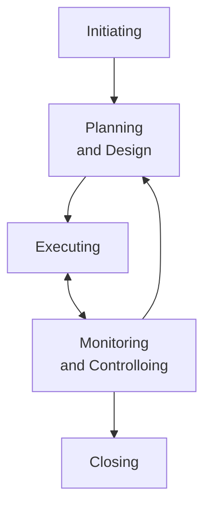

## 10 Best Project Management Books for the Project Professional

<https://project-management.com/top-10-best-project-management-books-to-keep-within-reach/>

1. A Guide to the Project Management Body of Knowledge
2. Project Management Absolute Beginner's Guide
3. The Fast Forward MBA in Project Management
4. Project Management: A Systems Approach to Planning, Scheduling, and Controlling
5. Guide to Project Management: Getting it right and achieving lasting benefit
6. Brilliant Project Management: What the best project managers know, do, and say
7. Project Management Lite: Just Enough to Get the Job Done...Nothing More
8. Project Management JumpStart
9. Strategic Project Management Made Simple – Practical Tools for Leaders and Teams
10. Making Things Happen: Mastering Project Management

PMBOK というアクロニムで通じるくらい著名な本らしい。

Project Management Absolute Beginner's Guide は入手しやすそう。

Project Management: A Systems Approach to Planning, Scheduling, and Controlling は改訂版が多い。

## Project management - Wikipedia

<https://en.wikipedia.org/wiki/Project_management>

### History

1900 年までは土木プロジェクトは、クリエイティブな建築家、技師、親方が自ら manage するのが一般的だった。

* Vitrvius (BC 1): ローマの建築家。
* Christopher Wren (1632-1723): 歴史上最も高く評価された英国人建築家。解剖学者、天文学者、幾何学者、数学者、物理学者でもある。
* Thomas Telford (1757-1834): スコットランドの土木技師。
* Isambard Kingdom Brunel (1806-1859): 工学の巨人と称される。

1950 年代、組織は複雑なエンジニアリングプロジェクトにプロジェクトマネジメントのツールやテクニックを体系的に適用し始めた。

* Henry Gantt (1861–1919): 計画管理法の父と称される。Gantt チャートで著名。
* Henry Fayol (1841-1925): プロジェクトおよびプログラムマネジメントに関連する
  知識体系の基礎を形成する五つのマネジメント機能を考案。

この二人には共通の師 Frederick Winslow Taylor (1856-1915) がいた（年齢が近いが）。
彼の科学的管理理論は、作業分解構造 (WBS) や資源配分など、現代のプロジェクト管理ツールの先駆けとなっている。

1950 年代は、エンジニアリングの中核的な分野が集まって一つの仕事をする、
現代のプロジェクトマネジメントの時代の始まりであった。
プロジェクトマネジメントが工学的モデルを持つ経営学から発生する独立した学問として認識されるようになった。

当時、2つの数理的なプロジェクトスケジューリングモデルが開発された。
これらの手法は、すぐに多くの民間企業に広まった。

* CPM (Critical Path Method): DuPont 社と Remington Rand 社の共同事業として、
  工場の保全プロジェクトを管理するために開発された。
* PERT (Program Evaluation and Review Technique): アメリカ海軍特殊プロジェクト室が、
  Lockheed 社、Booz Allen Hamilton 社と共同で開発した、ポラリスミサイル潜水艦
  計画の一環として開発された。

プロジェクト・コスト見積もり、コスト管理、工学的経済学の技術も、Hans Lang らによる
先駆的な研究によって発展していた。
1956 年、プロジェクトマネジメントとそれに関連する計画・スケジュール、コスト見積もり、
コスト・スケジュール管理（プロジェクト管理）の専門分野の初期の実務家によって、
米国コストエンジニア協会 ACCE が設立された。

AACEは先駆的な活動を続け、2006 年にポートフォリオ、プログラム、プロジェクト管理のための最初の統合プロセス
（トータルコスト管理フレームワーク）を発表しました。

1969 年、アメリカでプロジェクトマネジメント協会 (PMI) が設立された。
PMI は 1996 年に William Duncan を主著者とする *A Guide to the Project Management Body of Knowledge*
(PMBOK Guide) の原版を発行し、ほとんどのプロジェクト、ほとんどの時間に共通するマネジメントの実践を述べている。

### Project management types

プロジェクトマネジメントの手法は、あらゆるプロジェクトに適用することができる。
プロジェクトの規模や性質、業界によって、特定の型のプロジェクトに合わせられることが多い。
例えば、IT プロジェクトマネジメントは、計画、設計、開発、テスト、導入といった様々なライフサイクル段階を経て、
技術資産やサービスを提供することに特化したプロジェクトマネジメントであり、
IT プロジェクトマネジメントと呼ばれる。

また、プロジェクトマネジメントには、ハード（物理）型とソフト（非物理）型という分類もある。

プロジェクトマネジメントに共通するのは、時間、品質、コストという三つの重要な目標に焦点を当てることだ。
成功するプロジェクトとは、スケジュール通りに、予算内で、事前に合意した品質基準に従って完成させることであり、
プロジェクトの成否を決める「鉄の三角形」「三重の制約」を満たす。

プロジェクトマネージャーは、プロジェクトマネジメントの種類ごとに、
その業界に特化した再現性のあるテンプレートを開発し、活用する。
これにより、品質向上、納期短縮、コスト削減を目的としたプロジェクト計画が徹底され、
高い再現性を持つようになった。

### Approaches of project management

2017 年のある研究では、あらゆるプロジェクトの成功は、四つの重要な側面がプロジェクトに影響を与える
X とどれだけ整合しているかに依存すると示唆した。

* Plan: 計画・予測活動
* Process: すべての活動に対する全体的な取り組み方と計画過程
* People: 協力と通信がどのようであるかの動態を含む
* Power: 権限、意思決定者、組織図？、実施方針など

プロジェクト活動を組織し完了させるためのアプローチには、段階的、無駄のない、反復的、
漸進的なものなど、いくつもの方法がある。また、プロジェクト計画には、成果物ベース、
活動ベースなど、いくつかの拡張方法がある。

どのような方法を採用するにしても、プロジェクト全体の目的、スケジュール、コスト、
およびすべての参加者と利害関係者の役割と責任について慎重に検討する必要がある。

#### Benefits realization management

BRM は、製品やアウトプットではなく、プロジェクトの成果に焦点を当て、それがどの程
度実現されているかを測定し、プロジェクトを軌道に乗せることによって、通常のプロ
ジェクトマネジメント手法を強化するものだ。これにより、合意された要件、すなわちプ
ロジェクトの成功を実現しながらも、その要件から得られる利益、すなわち製品の成功を
実現できず、完成したプロジェクトが失敗に終わるリスクを低減することができる。

さらに、BRM の実践は、プロジェクトの成果と業務戦略の戦略的な整合性を確保する
ことを目的としている。 BRM の実践が、国や業界を問わず、戦略的な観点からプロジェ
クトの成功に影響を与えることを証明する最近の研究により、これらの実践の有効性が裏
付けられている。このような幅広い効果は、戦略的影響と呼ばれている。

例えば、従業員のデータを処理し、給与、休日、従業員の人事記録を短時間で管理し、エ
ラーを減らすコンピュータシステムを実現することに合意することが、プロジェクトを要
求事項に適合させる例として挙げられる。BRM では、システム導入後、導入前と比較して、
スタッフデータの処理や維持に必要なスタッフの時間やエラーを一定量削減することを合
意する場合がある。

#### Critical path method

クリティカルパス法とは、プロジェクト活動のスケジュールを決定するためのアルゴリズムだ。
予測に基づくプロジェクト計画に用いられる伝統的なプロセスだ。

CPM 法では、活動の順序、必要な作業工数、相互依存関係、その結果得られる line sequence ごとの余裕時間を評価し、
必要なプロジェクト期間を決定する。したがって、定義上、クリティカルパスは、
ネットワーク図上のタスクの経路のうち、余分な時間がないか非常に少ない経路となる。

#### Critical chain project management

クリティカルチェーンプロジェクトマネジメントは、制約条件理論をプロジェクトの計画・管理に応用したものだ。
プロジェクト管理に内在する不確実性に対処し、プロジェクト遂行に必要な資源
（物理的、人的スキル、管理・対応能力）の限られた利用可能性を考慮するために設計されている。

目標は、組織内のプロジェクトの流れ（スループット）を増大させることだ。
制約条件理論の五つの焦点化段階のうち最初の三つを適用し、
プロジェクトすべてのシステム制約と資源を特定する。この制約を克服するために、
クリティカルチェーン上のタスクは他のすべての活動より優先される。
最終的に、クリティカルチェーンのタスクが開始されなければならないときに、
資源が準備できていることを確認するために、プロジェクトを計画・管理し、
他の資源すべてをクリティカルチェーン下に置く。

#### Earned value management

EVM は、プロジェクトマネジメントを拡張し、プロジェクトの監視を改善する技術だ。
作業と価値（費用）の観点から、完成に向けたプロジェクトの進捗を見せる。
Earned Schedule とは EVM の理論と実践を拡張したものだ。

<!-- この項目は特に Wikipedia の個別エントリーをチェックすること -->

#### Iterative and incremental project management

プロジェクトマネジメントの批判的な研究では次のような指摘がされている：
段階的取り組み方では、大規模かつ複数の企業が参加するプロジェクト、未定義の要件、
あいまいな要件、変化の速い要件、高度のリスク、依存性、変化の速い技術を持つ
プロジェクトにはあまり適していない。
プロジェクトの初期段階で行われる計画は高度の不確実性に苦しんでいるので、
the cone of uncertainty はこの一部を説明している。
これは、ソフトウェア開発がしばしば新製品またはその実現であることから、特に顕著になる。

このような複雑性は、より探索的な、あるいは反復的で漸進的な取り組み方で扱う方が良
い。反復的で漸進的なプロジェクト管理のモデルがいくつか発展してきた：

* アジャイルプロジェクト管理
* 動的システム開発法
* 極限プロジェクト管理
* Innovation Engineering®

#### Lean project management

リーンプロジェクトマネジメントは、リーン生産方式の原則を用い、より少ない (lean) 無駄
とより短い時間で価値を提供することに重点を置く。

#### Project lifecycle

プロジェクトのライフサイクルには五つの段階があり、過程グループと呼ばれている。
グループそれぞれが相互に関連する一連の過程を表し、完了すべき一連の明確な段階を通じて作業を管理する。
このようなプロジェクト手法は、しばしば伝統的であるとか、ウォーターフォールであると言われる。

1. 開始 (Initiating)
2. 計画 (Planning)
3. 実行 (Executing)
4. 監視と制御 (Monitoring and Controlling)
5. 終了 (Closing)

業界によっては、これらの段階の変種を使用し、組織により適した名称に変更する場合もある。
例えば、実店舗の設計・建設に携わる場合、プロジェクトは通常、事前計画、概念設計、
概略設計、設計開発、施工図、施工管理といった段階を進行する。

段階的取り組みでは、小規模で明確なプロジェクトには有効だが、大規模なプロジェクト
や、より複雑であいまいな問題や潜在的な危険を抱えるプロジェクトでは、しばしば困難や失敗を
招くことになる。

#### Process-based management

プロセスベースマネジメントの導入は、OPM3 や CMMI (Capability Maturity Model
Integration) などの成熟度モデルの活用により推進されてきた。

#### Project production management

プロジェクト生産経営とは、資本プロジェクトの完遂に操作経営を応用することだ。
プロジェクト生産管理の体制は、プロジェクトが入力（原材料、情報、労働力、
工場、機械）を出力（商品・サービス）に変換するという、生産体系としての
プロジェクト観に基づいている。

#### Product-based planning

生産物ベースの計画は、プロジェクトマネジメントの構造化された取り組み方であり、
プロジェクト目標の達成に貢献するすべての生産物（プロジェクト成果物）を特定する
ことに基づく。この取り組み方の最も一般的な実装は PRINCE2 だ。

### Process groups

伝統的に、プロジェクトマネジメントは、四つから五つのプロジェクトマネジメント
プロセスグループと、コントロールシステムといういくつかの要素からなる。
どのような方法論や用語が使われていても、プロジェクトマネジメントの基本的な
プロセスや開発段階は同じだ。主なプロセス群は、一般的に次からなる：

* Initiation
* Planning
* Production or execution
* Monitoring and controlling
* Closing

探索的要素の強いプロジェクト環境（研究開発など）では、これらの段階に加え、
プロジェクトの継続を議論し決定する段階を設けることもある。例として、phase-gate
モデルがある。

<!-- 例のモデルはウォーターフォールと同じ -->

#### Initiating

開始過程は、プロジェクトの性質と範囲を決定する。この段階がうまくいかないと、プロ
ジェクトが業務の要求を満たすことに成功しなくなりがちだ。ここで必要なプロジェクト
統制は、業務環境を理解し、必要なコントロールがすべてプロジェクトに組み込まれてい
ることを確認することである。不備があれば報告し、修正するよう勧告する必要がある。

開始段階では、以下の領域を網羅した計画を立てる。これらの領域をプロジェクト開始文書
と呼ばれる一連の文書に記録することができる。文書はプロジェクト期間中の秩序を作るために
使われる。これらは、以下のようなものからなる傾向がある：

* プロジェクト提議：プロジェクトの背景、全体目標、期間。
* プロジェクト範囲：プロジェクトの方向性、軌道。
* product breakdown structure (PBS): 成果物・結末の階層とその構成要素。
* work breakdown structure (WBS): 日々の業務に至るまで、やるべきことの階層化。
* 責任分担表 (RACI - Responsible, Accountable, Consulted, Informed):
  成果物・結末に沿った役割と責任
* 暫定プロジェクト日程：マイルストーン、重要な日付、締切日。
* 測定可能な目標に対する業務要求の分析
* 現行事業の見直し
* 費用と利益の財務分析。予算を含む。
* 利害関係者分析：プロジェクトの利用者やサポート担当者がある。
* プロジェクト憲章：費用、課題、成果物、日程がある。
* SWOT 分析：事業の強み、弱み、機会、脅威の分析。

#### Planning

開始段階の後、プロジェクトは適切な詳細レベルまで計画される。
主な目的は、時間、費用、資源を適切に計画し、必要な作業を見積もり、プロジェクト
実行中のリスクを効果的に管理することである。
開始段階グループと同様に、適切な計画を立てることができなければ、プロジェクトが
目標を成功裏に達成する可能性は著しく下がる。

計画は、一般的に次で構成される：

* プロジェクト管理手法決定（画を完全に先行的に定義するのか、反復的に定義するのか、
  rolling waves で定義するのか等）。
* 範囲陳述書作成
* 計画班選出
* 成果物特定、PBS および WBS 作成
* 成果物を完成させるために必要な活動を特定し、その活動を論理的な順序でネットワーク化する。
* 活動に必要な資源の見積もり
* 活動の時間や費用の見積もり
* 日程策定
* 予算策定
* リスク計画
* 品質保証施策策定
* 作業開始の正式な承認を得る

また、情報交換や範囲管理の計画、役割と責任の明確化、プロジェクトで購入
するものの決定、初会合の開催などの追加的諸段階も一般的に推奨される。

新製品開発プロジェクトでは、最終製品の動作の概念設計をプロジェクトの計画活動と同
時に行うことがあり、成果物や計画活動を特定する際に計画チームに情報を提供するのに
役立つ場合がある。

#### Executing

実行している間中、実行の必要がある予定期限が何であるかを知らなければならない。
実行・実施局面では、プロジェクトマネジメント計画の成果物がそれに従って実行されることを確認する。
この局面では、人材、資材、予算などの資源を適切に配分、調整、管理する。
この局面の出力は、プロジェクトの成果物だ。

#### Project documentation

プロジェクトを成功させるには、プロジェクト内のあらゆるものを文書化することが重要
だ。予算、範囲、効果、歩調を維持するために、プロジェクトは各課題に関連する物理的
な文書を持たなければならない。正しい文書があれば、プロジェクトの要求が満たされて
いるかどうかを簡単に確認することができる。また、文書を管理することで、そのプロ
ジェクトで何がすでに完了したかという情報も得られる。プロジェクト全体の文書は、過
去にさかのぼって作業を参照する必要がある人に対して紙による痕跡を与える。ほとんど
の場合、文書管理は、プロジェクトの特定の局面を監視し、管理する最も成功した方法
だ。正しい文書化によって、プロジェクトが進むにつれてプロジェクトの成功が追跡さ
れ、観察されるようになる。正しく実行されれば、文書管理はプロジェクトの成功の基幹
となる。

#### Monitoring and controlling

監視と統制は、プロジェクトの実行を観察するために行われる過程で、潜在的な問題を適
時に特定し、必要に応じて是正措置をとってプロジェクトの実行を制御することができる
ようにする。主な利点は、プロジェクトの具合を定期的に観察・測定し、プロジェクト管
理計画との差異を特定することだ。

監視と統制には次が含まれる：

* 進行中のプロジェクト活動を測定すること
* プロジェクトの変数（費用、労力、範囲など）をプロジェクト管理計画やプロジェクト
  具合の基準値に対して監視すること
* 問題やリスクに適切に対処するための是正措置を特定すること、
* 統合変更管理を回避し得る要因に影響を与え、承認済みの変更しか実施されないように
  すること

プロジェクトにおける監視と統制を支える主な仕組み二つある。一つ目の契約は、一連の
規則と報酬を提供する。罰則や制裁によってしばしば支えられる。二つ目の業務とマネジ
メントの学者は、プロジェクトの目的を達成するための統合人（プロジェクト男爵とも呼
ばれる）の役割に注目している。一方、プロジェクトマネジメントの最近の研究では、契
約と統合人の相互関係の型に疑問を呈している。また、このような監視の仕組みは、ある
種の組織が他の組織を利用する利点を減少させるため、代替物として機能していると主張
する者もいる。

多局面プロジェクトでは、監視と統制のプロセスは、プロジェクト局面間の反響も提供
し、プロジェクトをプロジェクトマネジメントプランに適合させるための是正措置や予防
措置を実施する。

プロジェクト維持は継続的な過程であり、以下のものを含む：

* エンドユーザーへの継続的なサポート
* エラーの修正
* 時間の経過に伴う製品の更新

この段階では、監査人はユーザーの問題がいかに効果的かつ迅速に解決されるかに注目す
る必要がある。

建設プロジェクトの途中で、作業範囲が変更されることがある。変更は、建設過程におい
て普通であり予期される部分だ。変更は、必要な設計の修正、現場条件の違い、
材料の入手可能性、請負業者の要求する変更、価値工学、第三者からの
影響など、さまざまな要因によって生じる。現場で変更を実行するだけでなく、通常、
実際に何が施工されたかを示すために、変更を文書化する必要があるのが普通だ。
これは変更管理と呼ばれる。したがって、所有者は通常、すべての変更、より具体的には、
完成した仕事の有形部分を修正する変更のすべてを示す最終記録を要求する。この記録
は、契約文書、通常は、設計図面に作成されるが、必ずしもこれに限定されるものではな
い。このような努力の末に出来上がったものが、業界用語で竣工図 (as-built) だ。
建設工事契約では、この図面の提出が義務付けられる。
建設文書管理は、オンラインまたはデスクトップのソフトウェアシステムを使用して、
あるいは物理的な文書によって維持される非常に重要な作業だ。建設業が正しい文書を
維持するための正当性が高まっているため、文書管理システムの需要が高まっているのだ。

プロジェクトに変更が生じた場合、プロジェクトの実行可能性を再評価する必要がある。
プロジェクトの当初の目標やゴールを見失わないようにすることが重要だ。変更が積み重
なると、予測された結果が、当初提案したプロジェクトへの投資を正当化できなくなるこ
とがある。プロジェクトマネジメントを成功させるには、これらの要素を特定し、進捗状
況を追跡、監視し、プロジェクト開始時に説明した時間と予算の枠内に収まるようにす
る。プロジェクトのライフサイクルに沿って、その進捗と予想期間に関する最も有益な監
視点を特定するための正確な方法が提案されている。

#### Closing

終結は、プロジェクトの正式な受諾と終了を含む。管理活動は、ファイルのアーカイブ化、
教訓の文書化などを含む。

この局面の構成：

* 契約の終結：各契約の完了と決着（未決事項の解決を含む）、プロジェクトまたはプロジェクト局面に適用される各契約を締結する。
* プロジェクト終結：プロジェクトまたはプロジェクト局面を正式に終了させるために、すべての過程グループにわたる活動すべてを終了させる。

また、この局面には実施後の見直しも含まれます。プロジェクトチームが経験から学び、
今後のプロジェクトに活かすために重要な局面だ。通常、実施後の見直しでは、プロジェ
クトでうまくいったこと、失敗したことを分析し、教訓を導き出す。
